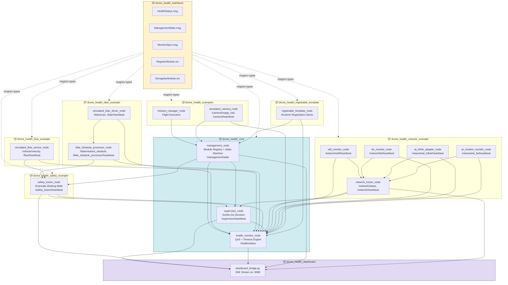
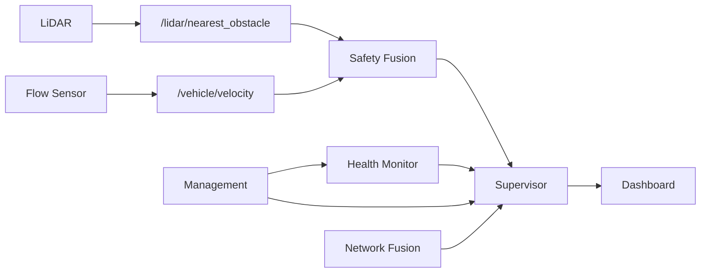

# Drone Health Monitoring Framework

[](https://docs.ros.org/)
[](https://en.cppreference.com/w/cpp/17)
[](https://www.python.org/)

A comprehensive, modular ROS 2 framework for autonomous drone health monitoring, system management, and safety supervision. This framework provides a complete closed-loop safety architecture — from sensor data ingestion to global system authorization — with runtime module registration, planned deregistration, and a live web dashboard.

---

## 🏗️ System Architecture



---

## 📦 Package Overview

| Package | Purpose |
|---|---|
| `drone_health_interfaces` | Shared messages and services used by all packages |
| `drone_health_core` | Core nodes: Management, Health Monitor, Supervisor |
| `drone_health_safety_example` | Safety Fusion Node — kinematic braking clearance |
| `drone_health_lidar_example` | Simulated LiDAR driver + obstacle processor |
| `drone_health_flow_example` | Simulated flow/velocity sensor |
| `drone_health_network_example` | WiFi, LTE, AT modem monitors + network fusion |
| `drone_health_examples` | Mission manager + simulated camera with deregistration |
| `drone_health_registrable_template` | Reusable template for runtime-registered modules |
| `drone_health_dashboard` | Web dashboard with live SSE streaming |

---

## 🚀 Complete Launch Sequence

### 0. Prerequisites

```bash
cd /home/nila/Desktop/drone_health_modular_ws
source /opt/ros/jazzy/setup.bash
source install/setup.bash
```

### 1. Core Infrastructure (Start First)

```bash
# Terminal 1: Management Node
ros2 run drone_health_core management_node --ros-args --params-file \
  src/drone_health_core/management/management.yaml

# Terminal 2: Health Monitor
ros2 run drone_health_core health_monitor_node --ros-args --params-file \
  src/drone_health_core/health_monitor/health_monitor.yaml

# Terminal 3: Supervisor
ros2 run drone_health_core supervisor_node --ros-args --params-file \
  src/drone_health_core/supervisor/supervisor.yaml
```

### 2. Sensor Layer

```bash
# Terminal 4: LiDAR Driver
ros2 run drone_health_lidar_example simulated_lidar_driver_node

# Terminal 5: LiDAR Processor
ros2 run drone_health_lidar_example lidar_obstacle_processor_node

# Terminal 6: Flow Sensor
ros2 run drone_health_flow_example simulated_flow_sensor_node \
  --ros-args -p simulate_motion:=true
```

### 3. Safety Fusion

```bash
# Terminal 7: Safety Fusion Node
ros2 run drone_health_safety_example safety_fusion_node --ros-args --params-file \
  src/drone_health_safety_example/safety_fusion/safety_fusion.yaml
```

### 4. Network Monitoring (Optional)

```bash
# Terminal 8: WiFi Monitor
ros2 run drone_health_network_example wifi_monitor_node

# Terminal 9: LTE Monitor
ros2 run drone_health_network_example lte_monitor_node

# Terminal 10: Network Fusion
ros2 run drone_health_network_example network_fusion_node

# Terminal 11: AT-HiLink Adapter
ros2 run drone_health_network_example at_hilink_adapter_node

# Terminal 12: AT Modem Monitor (Mock Mode)
ros2 run drone_health_network_example at_modem_monitor_node \
  --ros-args -p mock_mode:=true
```

### 5. Optional Demo Modules

```bash
# Terminal 13: Registrable Template Node
ros2 run drone_health_registrable_template registrable_template_node

# Terminal 14: Simulated Camera
ros2 run drone_health_examples simulated_camera_node

# Terminal 15: Mission Manager (or use terminal commands below)
ros2 run drone_health_examples mission_manager_node \
  --ros-args -p start_delay_s:=5 -p inspection_duration_s:=10
```

### 6. Dashboard

```bash
# Terminal 16: Dashboard Bridge
ros2 run drone_health_dashboard dashboard_bridge.py
```

Open in browser: **http://localhost:8080**

---

## 🧪 Test Cases & Manual Commands

### Mission State Control

```bash
# Activate mission
ros2 service call /management/set_mission_active std_srvs/srv/SetBool "{data: true}"

# Deactivate mission
ros2 service call /management/set_mission_active std_srvs/srv/SetBool "{data: false}"

# Toggle maintenance mode
ros2 service call /management/set_maintenance_mode std_srvs/srv/SetBool "{data: true}"
ros2 service call /management/set_maintenance_mode std_srvs/srv/SetBool "{data: false}"
```

### Template Node — Runtime Registration & Deregistration

```bash
# Self-deregister via template's own service
ros2 service call /template/request_deregister std_srvs/srv/Trigger "{}"

# Operator-triggered deregistration (for deadline/stale testing)
ros2 service call /management/deregister_module drone_health_interfaces/srv/DeregisterModule \
  "{module_name: template_node, reason: deregistered}"
```

### Camera Node — Self-Deregistration & Restore

```bash
# Self-deregister via camera's own service
ros2 service call /camera/request_deregister std_srvs/srv/Trigger "{}"

# Operator-triggered deregistration
ros2 service call /management/deregister_module drone_health_interfaces/srv/DeregisterModule \
  "{module_name: 'camera', reason: 'deregistered'}"

# Restore camera to active state
ros2 service call /management/set_module_inactive drone_health_interfaces/srv/SetModuleInactive \
  "{module_name: 'camera', inactive: false, reason: 'deregistered'}"
```

---

## 🔄 Data Flow Summary



---

## 📄 License

MIT License. Free to use for academic and commercial robotics projects.
