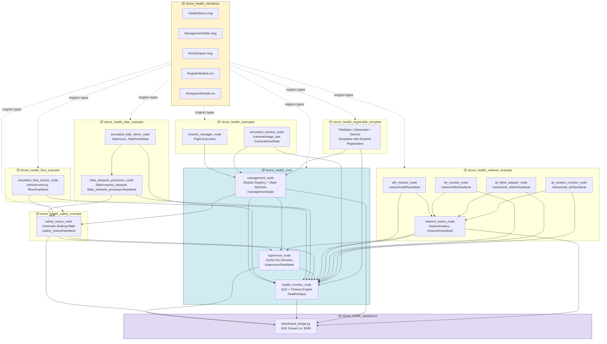
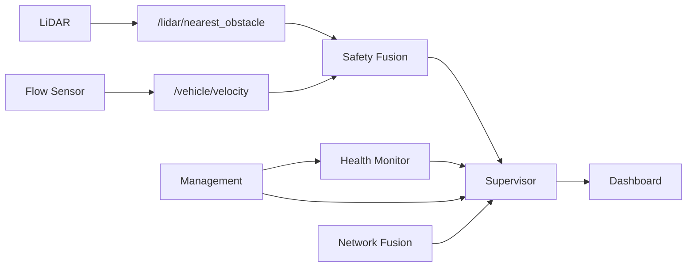

# Drone Health Monitoring Framework

[](https://docs.ros.org/)
[](https://en.cppreference.com/w/cpp/17)
[](https://www.python.org/)

A comprehensive, modular ROS 2 framework for autonomous drone health monitoring, system management, and safety supervision. This framework provides a complete closed-loop safety architecture — from sensor data ingestion to global system authorization — with runtime module registration, planned deregistration, and a live web dashboard.

---

## 📋 Prerequisites & Installation

### System Requirements
- **OS:** Ubuntu 22.04 LTS or later
- **ROS 2 Distribution:** Jazzy  
- **C++ Compiler:** C++17 compatible (GCC 9+)
- **Python:** 3.8+
- **Build System:** colcon, CMake 3.22+

### Quick Installation

#### 1. Install ROS 2 Jazzy
```bash
# Follow official installation guide at:
# https://docs.ros.org/en/jazzy/Installation.html

# After installation, source the setup script
source /opt/ros/jazzy/setup.bash
```

#### 2. Install Build Dependencies
```bash
sudo apt update
sudo apt install -y \
    build-essential cmake git \
    python3-colcon-common-extensions python3-rosdep \
    ros-jazzy-rclcpp ros-jazzy-std-msgs ros-jazzy-sensor-msgs
```

#### 3. Create and Build Workspace
```bash
# Create workspace directory
mkdir -p ~/drone_health_ws/src
cd ~/drone_health_ws

# Clone repository
git clone https://github.com/NILAMATHI1999/drone-health-modular-framework.git \
  src/drone-health

# Install dependencies
rosdep install --from-paths src --ignore-src -r -y

# Build all packages
colcon build

# Source the workspace
source install/setup.bash
```

#### 4. Install Dashboard Dependencies
```bash
# Install Python packages for dashboard
pip install flask flask-cors python-socketio
```

---

## ✅ Verify Your Setup

Before starting the full system, verify everything is installed correctly:

```bash
# Check ROS 2
ros2 --version

# Check colcon
colcon build --help 2>&1 | head -1

# Verify packages are built (should see 9 packages)
ros2 pkg list | grep drone_health

# Check ROS 2 is responding
ros2 node list
# (Should work without errors; may be empty if no nodes running)
```

If any command fails, review the Prerequisites section above or check the Troubleshooting Guide below.

---

## 🏗️ System Architecture


```mermaid
graph TD

    subgraph PKG_INTERFACES ["📦 drone_health_interfaces"]
        MSG1["HealthStatus.msg"]
        MSG2["ManagementState.msg"]
        MSG3["MonitorSpec.msg"]
        SRV1["RegisterModule.srv"]
        SRV2["DeregisterModule.srv"]
    end

    subgraph PKG_LIDAR ["📦 drone_health_lidar_example"]
        LIDAR["simulated_lidar_driver_node<br/>/lidar/scan, /lidar/heartbeat"]
        LPROC["lidar_obstacle_processor_node<br/>/lidar/nearest_obstacle,<br/>/lidar_obstacle_processor/heartbeat"]
    end

    subgraph PKG_FLOW ["📦 drone_health_flow_example"]
        FLOW["simulated_flow_sensor_node<br/>/vehicle/velocity, /flow/heartbeat"]
    end

    subgraph PKG_SAFETY ["📦 drone_health_safety_example"]
        SF["safety_fusion_node<br/>Kinematic Braking Math<br/>/safety_fusion/heartbeat"]
    end

    subgraph PKG_CORE ["📦 drone_health_core"]
        MN["management_node<br/>Module Registry + State Machine<br/>/management/state"]
        HM["health_monitor_node<br/>QoS + Timeout Engine<br/>/health/status"]
        SV["supervisor_node<br/>Go/No-Go Decision<br/>/supervisor/heartbeat"]
    end

    subgraph PKG_NETWORK ["📦 drone_health_network_example"]
        WIFI["wifi_monitor_node<br/>/network/wifi/heartbeat"]
        LTE["lte_monitor_node<br/>/network/lte/heartbeat"]
        HILINK["at_hilink_adapter_node<br/>/network/at_hilink/heartbeat"]
        MODEM["at_modem_monitor_node<br/>/network/at_lte/heartbeat"]
        NF["network_fusion_node<br/>/network/status, /network/heartbeat"]
    end

    subgraph PKG_EXAMPLES ["📦 drone_health_examples"]
        MM["mission_manager_node<br/>Flight Executive"]
        CAM["simulated_camera_node<br/>/camera/image_raw,<br/>/camera/heartbeat"]
    end

    subgraph PKG_TEMPLATE ["📦 drone_health_registrable_template"]
        TEMPLATE["Publisher / Subscriber / Service<br/>Templates with Runtime Registration"]
    end

    subgraph PKG_DASHBOARD ["📦 drone_health_dashboard"]
        DASH["dashboard_bridge.py<br/>SSE Stream on :8080"]
    end

    %% ---- Sensor to Processing ----
    LIDAR --> LPROC

    %% ---- Processing/Sensors to Safety ----
    LPROC --> SF
    FLOW --> SF

    %% ---- Safety to Supervisor ----
    SF --> SV

    %% ---- Management orchestration ----
    MN --> HM
    MN --> SV
    MN --> SF
    MM --> MN
    CAM --> MN
    TEMPLATE --> MN

    %% ---- Network fusion to Supervisor ----
    NF --> SV
    WIFI --> NF
    LTE --> NF
    HILINK --> NF
    MODEM --> NF

    %% ---- Everything reports health status to HM ----
    LIDAR --> HM
    FLOW --> HM
    LPROC --> HM
    SF --> HM
    SV --> HM
    NF --> HM
    WIFI --> HM
    LTE --> HM
    HILINK --> HM
    MODEM --> HM
    CAM --> HM
    TEMPLATE --> HM

    %% ---- Dashboard aggregates everything ----
    SV --> DASH
    SF --> DASH
    HM --> DASH
    MN --> DASH
    NF --> DASH

    %% ---- Interfaces dependency (compile-time, dashed) ----
    PKG_INTERFACES -.->|msg/srv types| PKG_CORE
    PKG_INTERFACES -.->|msg/srv types| PKG_LIDAR
    PKG_INTERFACES -.->|msg/srv types| PKG_FLOW
    PKG_INTERFACES -.->|msg/srv types| PKG_SAFETY
    PKG_INTERFACES -.->|msg/srv types| PKG_NETWORK
    PKG_INTERFACES -.->|msg/srv types| PKG_EXAMPLES
    PKG_INTERFACES -.->|msg/srv types| PKG_TEMPLATE

    style PKG_INTERFACES fill:#fff3cd,stroke:#856404
    style PKG_CORE fill:#d1ecf1,stroke:#0c5460
    style PKG_DASHBOARD fill:#e2d9f3,stroke:#5a3d99
```

---

## 📦 Package Overview

| Package | Purpose |
|---|---|
| `drone_health_interfaces` | Shared messages and services used by all packages |
| `drone_health_core` | Core nodes: Management, Health Monitor, Supervisor |
| `drone_health_safety_example` | Safety Fusion Node — kinematic braking clearance |
| `drone_health_lidar_example` | Simulated LiDAR driver + obstacle processor |
| `drone_health_flow_example` | Simulated flow/velocity sensor |
| `drone_health_network_example` | WiFi, LTE, AT modem monitors + network fusion |
| `drone_health_examples` | Mission manager + simulated camera with deregistration |
| `drone_health_registrable_template` | Reusable template for runtime-registered modules |
| `drone_health_dashboard` | Web dashboard with live SSE streaming |

---

## 🚀 Complete Launch Sequence

### 0. Setup Workspace

```bash
# Navigate to your workspace (where you ran colcon build)
cd ~/drone_health_ws

# Source ROS 2 setup
source /opt/ros/jazzy/setup.bash

# Source workspace setup
source install/setup.bash

# Verify setup worked
ros2 node list  # Should show no errors
```

**Note:** Replace `~/drone_health_ws` with your actual workspace path if different.

---

### 1. Core Infrastructure (Start First)

```bash
# Terminal 1: Management Node
ros2 run drone_health_core management_node --ros-args --params-file \
  src/drone_health_core/management/management.yaml

# Terminal 2: Health Monitor
ros2 run drone_health_core health_monitor_node --ros-args --params-file \
  src/drone_health_core/health_monitor/health_monitor.yaml

# Terminal 3: Supervisor
ros2 run drone_health_core supervisor_node --ros-args --params-file \
  src/drone_health_core/supervisor/supervisor.yaml
```

### 2. Sensor Layer

```bash
# Terminal 4: LiDAR Driver
ros2 run drone_health_lidar_example simulated_lidar_driver_node

# Terminal 5: LiDAR Processor
ros2 run drone_health_lidar_example lidar_obstacle_processor_node

# Terminal 6: Flow Sensor
ros2 run drone_health_flow_example simulated_flow_sensor_node \
  --ros-args -p simulate_motion:=true
```

### 3. Safety Fusion

```bash
# Terminal 7: Safety Fusion Node
ros2 run drone_health_safety_example safety_fusion_node --ros-args --params-file \
  src/drone_health_safety_example/safety_fusion/safety_fusion.yaml
```

### 4. Network Monitoring (Optional for Basic Testing)

⚠️ **Note:** Network monitoring nodes are optional for basic framework validation, but network status is monitored by the supervisor. Omit this section if you want minimal setup.

```bash
# Terminal 8: WiFi Monitor
ros2 run drone_health_network_example wifi_monitor_node

# Terminal 9: LTE Monitor
ros2 run drone_health_network_example lte_monitor_node

# Terminal 10: Network Fusion (Required if using network health in decisions)
ros2 run drone_health_network_example network_fusion_node

# Terminal 11: AT-HiLink Adapter (Optional - for specific modem hardware)
ros2 run drone_health_network_example at_hilink_adapter_node

# Terminal 12: AT Modem Monitor (Optional - Mock Mode)
ros2 run drone_health_network_example at_modem_monitor_node \
  --ros-args -p mock_mode:=true
```

### 5. Optional Demo Modules & Runtime Registration Examples

```bash
# Terminal 13a: Registrable Publisher Template (RECOMMENDED)
ros2 run drone_health_registrable_template registrable_publisher_template_node \
  --ros-args --params-file \
  src/drone_health_registrable_template/config/registrable_publisher_template.yaml

# (Alternative) Terminal 13b: Registrable Subscriber Template
# ros2 run drone_health_registrable_template registrable_subscriber_template_node \
#   --ros-args --params-file \
#   src/drone_health_registrable_template/config/registrable_subscriber_template.yaml

# (Alternative) Terminal 13c: Registrable Service Template
# ros2 run drone_health_registrable_template registrable_service_template_node \
#   --ros-args --params-file \
#   src/drone_health_registrable_template/config/registrable_service_template.yaml

# Terminal 14: Simulated Camera (Includes self-deregistration demo)
ros2 run drone_health_examples simulated_camera_node

# Terminal 15: Mission Manager (Flight Executive Logic)
ros2 run drone_health_examples mission_manager_node \
  --ros-args -p start_delay_s:=5 -p inspection_duration_s:=10
```

**Template Notes:** Choose ONE template to run, or run all three in separate terminals to test different communication patterns.

### 6. Web Dashboard

The dashboard provides real-time visualization of system health status, module registration events, network connectivity, and supervisor decisions.

```bash
# Terminal 16: Start Dashboard Bridge
ros2 run drone_health_dashboard dashboard_bridge.py

# Expected output:
# [INFO] Starting dashboard on 0.0.0.0:8080
# [INFO] SSE stream active
```

#### Access the Dashboard

Open your web browser and navigate to:
- **Same machine:** http://localhost:8080
- **Different machine:** http://<your-machine-ip>:8080 (replace with actual IP, e.g., 192.168.1.100)

```bash
# Examples:
open http://localhost:8080          # macOS
xdg-open http://localhost:8080      # Linux
start http://localhost:8080         # Windows
```

#### Dashboard Configuration

If port 8080 is already in use, edit the configuration:

```bash
# Edit dashboard config
nano src/drone_health_dashboard/config/dashboard.yaml

# Change the port line:
# port: 8080  →  port: 8888
```

#### Dashboard Troubleshooting

| Issue | Solution |
|-------|----------|
| Port 8080 already in use | Edit `dashboard.yaml` to use different port (see above) |
| No data appearing | Verify `health_monitor_node` is running: `ros2 node list` |
| Connection refused | Check firewall, ensure `dashboard_bridge.py` is running |
| Blank page | Check browser console (F12) for JavaScript errors |

---

## 🧪 Test Cases & Manual Commands

### Mission State Control

```bash
# Activate mission
ros2 service call /management/set_mission_active std_srvs/srv/SetBool "{data: true}"

# Deactivate mission
ros2 service call /management/set_mission_active std_srvs/srv/SetBool "{data: false}"

# Toggle maintenance mode
ros2 service call /management/set_maintenance_mode std_srvs/srv/SetBool "{data: true}"
ros2 service call /management/set_maintenance_mode std_srvs/srv/SetBool "{data: false}"
```

### Template Node — Runtime Registration & Deregistration

First, check what's registered:

```bash
# Monitor management state to see registered modules
ros2 topic echo /management/state
# Look for "managed_modules" list
```

Then deregister:

```bash
# Self-deregister via template's own service
ros2 service call /template_publisher/request_deregister std_srvs/srv/Trigger "{}"

# Or operator-triggered deregistration
ros2 service call /management/deregister_module drone_health_interfaces/srv/DeregisterModule \
  "{module_name: publisher_template_node, reason: deregistered}"

# For other template types:
# Subscriber: module_name: subscriber_template_node
# Service:    module_name: service_template_node
```

### Camera Node — Self-Deregistration & Restore

```bash
# Self-deregister via camera's own service
ros2 service call /camera/request_deregister std_srvs/srv/Trigger "{}"

# Operator-triggered deregistration
ros2 service call /management/deregister_module drone_health_interfaces/srv/DeregisterModule \
  "{module_name: 'camera', reason: 'deregistered'}"

# Restore camera to active state
ros2 service call /management/set_module_inactive drone_health_interfaces/srv/SetModuleInactive \
  "{module_name: 'camera', inactive: false, reason: 'deregistered'}"
```

---

## 🔄 Data Flow Summary


```mermaid
graph LR
    LIDAR["LiDAR"] --> OBS["/lidar/nearest_obstacle"]
    FLOW["Flow Sensor"] --> VEL["/vehicle/velocity"]
    OBS --> SF[Safety Fusion]
    VEL --> SF
    SF --> SV[Supervisor]
    HM[Health Monitor] --> SV
    MN[Management] --> HM
    MN --> SV
    NF[Network Fusion] --> SV
    SV --> DASH[Dashboard]
```

---

## 🔧 Troubleshooting Guide

### "Package not found" Error

**Error message:**
```
Package 'drone_health_core' not found
```

**Solutions:**

1. Verify workspace is built:
   ```bash
   cd ~/drone_health_ws
   colcon build
   source install/setup.bash
   ```

2. Check package list:
   ```bash
   ros2 pkg list | grep drone_health
   ```

3. Clear build cache if needed:
   ```bash
   rm -rf build/ install/ log/
   colcon build
   ```

---

### "Node failed to initialize" / Segmentation Fault

**Debugging steps:**
```bash
# Run node with verbose output
ROS_LOG_LEVEL=debug ros2 run drone_health_core management_node

# Check if required config file exists
ls src/drone_health_core/management/management.yaml

# Look for kernel messages
dmesg | tail -20
```

**Common causes:**
- Missing config file
- Incorrect `ROS_DOMAIN_ID` mismatch between nodes
- Permissions issue on config files
- ROS 2 environment not properly sourced

**Fix:**
```bash
# Reset environment
unset ROS_DOMAIN_ID
source /opt/ros/jazzy/setup.bash
source install/setup.bash
```

---

### Nodes Can't Communicate / Topics Not Found

**Check network connectivity:**
```bash
# In terminal 1: List all topics
ros2 topic list

# In terminal 2: List all active nodes
ros2 node list

# Check if health_monitor is receiving heartbeats
ros2 topic echo /health/status

# Check management state
ros2 topic echo /management/state
```

**Common causes:**
- `ROS_DOMAIN_ID` mismatch between nodes
- Firewall blocking communication
- DDS configuration issues

**Fix:**
```bash
# Ensure all nodes use same domain ID
export ROS_DOMAIN_ID=0

# Or edit config files:
# src/drone_health_core/management/management.yaml
domain_id: 0
```

---

### Dashboard Shows "No Data Received"

**Check Health Monitor:**
```bash
# Verify health_monitor_node is running
ros2 node list | grep health_monitor

# Check if it's receiving data
ros2 topic list | grep health

# Echo the health status topic
ros2 topic echo /health/status
```

**Check Dashboard Bridge:**
```bash
# Verify dashboard script is running
ps aux | grep dashboard_bridge

# Check for Python errors (run directly)
cd src/drone_health_dashboard/scripts
python3 dashboard_bridge.py
```

**Common causes:**
- `health_monitor_node` not running
- Dashboard config points to wrong topic names
- Python dependencies missing (Flask, socketio)

**Fix:**
```bash
# Install missing dependencies
pip install flask flask-cors python-socketio

# Restart dashboard
pkill dashboard_bridge.py
ros2 run drone_health_dashboard dashboard_bridge.py
```

---

### Supervisor Keeps Reporting "NO_GO" Status

**Check Supervisor Inputs:**
```bash
# Verify all required data sources are publishing
ros2 topic list | grep -E "(health|safety|network)"

# Check individual component status
ros2 topic echo /safety_fusion/heartbeat
ros2 topic echo /lidar_obstacle_processor/heartbeat
ros2 topic echo /network/status
```

**Review Supervisor Config:**
```bash
# Edit supervisor configuration
nano src/drone_health_core/supervisor/supervisor.yaml

# Look for timeout values - may be too strict
# Increase heartbeat_timeout_ms if modules are slow
heartbeat_timeout_ms: 1000  # Default: 1000ms = 1 second
```

**Typical causes:**
- Component publishing too slowly (> timeout)
- Component crashed but still in registry
- Network latency causing delays

**Fix:**
```bash
# Restart the component node
# Or deregister it:
ros2 service call /management/deregister_module \
  drone_health_interfaces/srv/DeregisterModule \
  "{module_name: 'slow_component', reason: 'timeout'}"
```

---

### Template Node Fails to Register

**Error message:**
```
Failed to register with management node
```

**Debugging:**
```bash
# Verify management node is running
ros2 node list | grep management

# Check if register service exists
ros2 service list | grep register

# Call register service manually to test
ros2 service call /management/register_module \
  drone_health_interfaces/srv/RegisterModule \
  "{module_name: 'test_module'}"
```

**Common causes:**
- Management node not started
- Service call malformed
- Module already registered with same name

**Fix:**
```bash
# Deregister existing module first
ros2 service call /management/deregister_module \
  drone_health_interfaces/srv/DeregisterModule \
  "{module_name: 'publisher_template_node', reason: 'restart'}"

# Then restart template node
ros2 run drone_health_registrable_template registrable_publisher_template_node
```

---

### Build Fails with CMake Errors

**Solution:**
```bash
# Clean build artifacts
rm -rf build/ install/ log/

# Rebuild with verbose output
colcon build --event-handlers console_direct+

# If still failing, check CMake version
cmake --version  # Should be 3.22 or higher
```

---

### Python Import Errors

**Solution:**
```bash
# Reinstall Python dependencies
pip install --upgrade pip
pip install flask flask-cors python-socketio

# For additional tools
pip install langchain-core langchain-text-splitters sentence-transformers
```

---

### C++ Compilation Errors

**Solution:**
```bash
# Check C++ compiler
g++ --version  # Should be GCC 9 or higher

# Update compiler if needed
sudo apt update
sudo apt install build-essential

# Rebuild packages individually to identify which fails
colcon build --packages-select drone_health_core --event-handlers console_direct+
```

---

## 📊 Getting Help

- **ROS 2 Documentation:** https://docs.ros.org/en/jazzy/
- **View node logs:** `ros2 run drone_health_core management_node 2>&1 | tee node.log`
- **Check GitHub issues:** https://github.com/NILAMATHI1999/drone-health-modular-framework/issues
- **Enable debug logging:**
  ```bash
  ROS_LOG_LEVEL=debug ros2 run drone_health_core management_node
  ```

---

## 📄 License

MIT License. Free to use for academic and commercial robotics projects.
