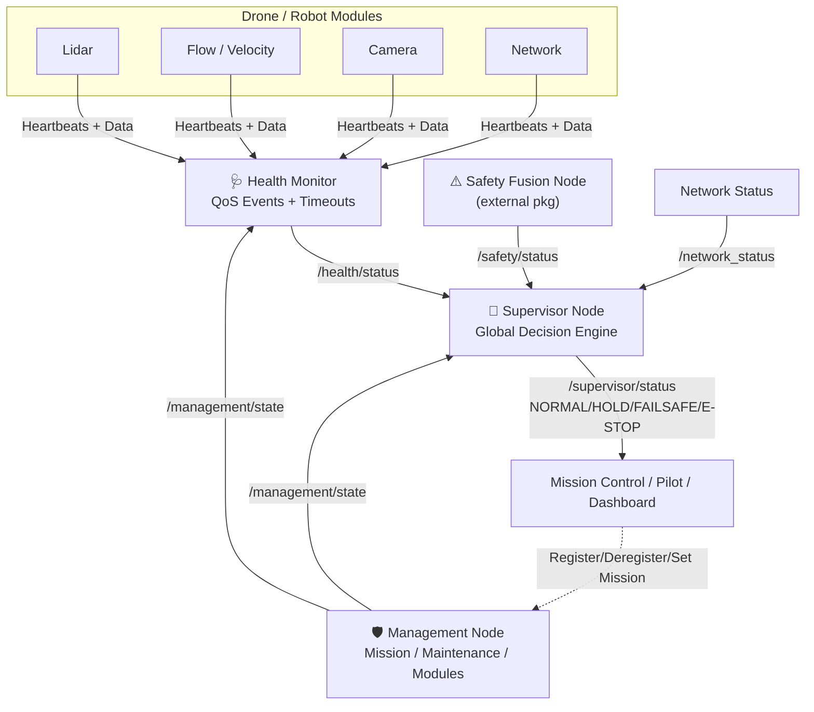
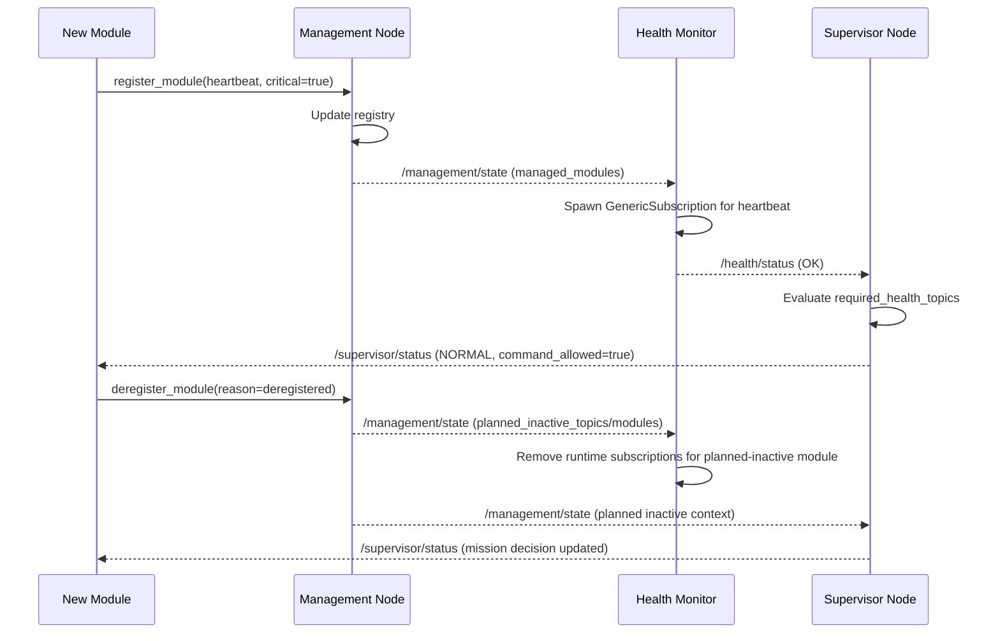
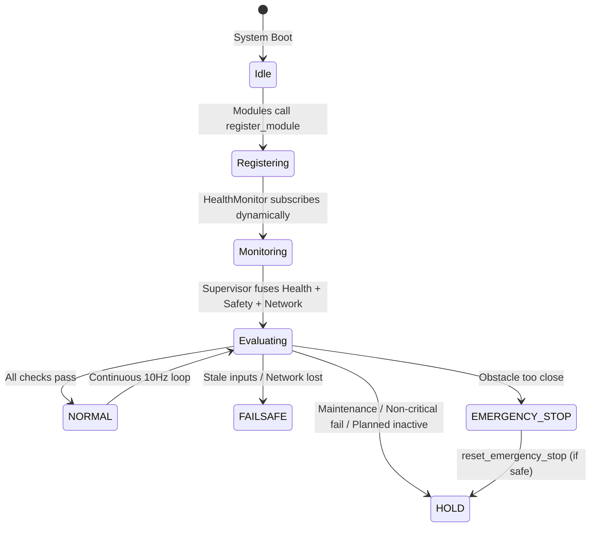
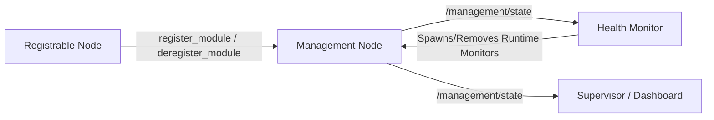
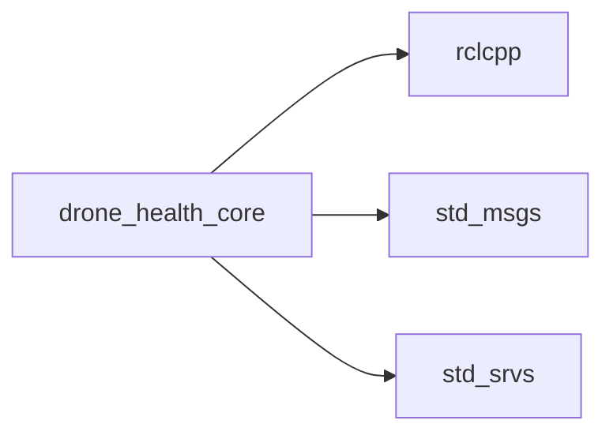

# drone_health_core

Core health, management, and supervision package for the drone health monitoring framework. This package provides the complete backend triad — **Health Monitor**, **Management Node**, and **Supervisor Node** — that work together to give any robotic platform a production-grade safety and diagnostics layer.

> **Note:** All custom message and service definitions (`HealthStatus`, `ManagementState`, `SupervisorStatus`, `RegisterModule`, etc.) live in the separate `drone_health_interfaces` package. This package only contains node implementations and runtime configuration.

---

## 🏗️ System Architecture

The three nodes form a layered pipeline: raw topic diagnostics flow upward into mission/maintenance context, which then flows into a single global Go/No-Go decision.



**Flow Summary:**
1. **Health Monitor** watches every configured and dynamically registered topic, reporting `OK / STALE / ERROR / INACTIVE / UNKNOWN` per topic.
2. **Management Node** owns mission/maintenance state and the module registry, telling Health Monitor which topics are *planned inactive* and telling Supervisor whether a mission is active.
3. **Supervisor Node** fuses Health, Safety, Network, and Management state into one authoritative `SupervisorStatus`, which gates whether any command is allowed to execute.

---

## 📦 Nodes

```text
health_monitor/
  health_monitor_node.cpp
  health_monitor.yaml

management/
  management_node.cpp
  management.yaml

supervisor/
  supervisor_node.cpp
  supervisor.yaml
```

---

## 🔗 Inter-Node Communication



---

## 🧩 Responsibility Split

### 🩺 Health Monitor
| Capability | Detail |
|---|---|
| Static monitoring | YAML-configured typed subscriptions at startup |
| Dynamic monitoring | Runtime `GenericSubscription` spawned from `/management/state` for heartbeat and data topics |
| Fault detection | DDS QoS deadline/liveliness events **+** software timeout fallback (100ms) |
| Mission awareness | Ignores planned-inactive topics/modules so expected downtime is not reported as a failure |
| Output | `/health/status` per-topic health report |

### 🛡️ Management Node
| Capability | Detail |
|---|---|
| Mission control | `mission_active` flag with strict safety interlocks |
| Maintenance mode | Blocks/unblocks topic alerting system-wide |
| Module registry | Static (YAML) + dynamic (`register_module` / `deregister_module` services) |
| Planned inactivity | Tracks per-module/topic reasons (`maintenance`, `optional_disabled`, etc.) |
| Output | `/management/state`, `/management/heartbeat` |

### 🧭 Supervisor Node
| Capability | Detail |
|---|---|
| Fusion | Combines `/safety/status`, `/health/status`, `/network_status`, `/management/state` |
| Failsafe ladder | `UNKNOWN → NORMAL → HOLD → FAILSAFE → EMERGENCY_STOP` |
| Latching | Emergency stop latches on obstacle proximity, requires explicit reset service |
| Network grace period | Distinguishes brief packet loss (`HOLD`) from total loss (`FAILSAFE`) |
| Output | `/supervisor/status` — the single source of truth for `command_allowed` |

---

## 🔄 Combined Decision Flow



---

## 🚫 What This Package Does Not Do

This package is intentionally scoped to **diagnostics, lifecycle, and authorization** — not autonomy itself:

- ❌ Mission sequencing / waypoint navigation
- ❌ Return-to-home implementation
- ❌ PX4 / ArduPilot flight control logic
- ❌ Dashboard frontend
- ❌ Simulated sensors

Those belong to separate modules or future robot/autonomy integration that **consumes** `/supervisor/status` as their command-authorization gate.

---

## 🛠️ Build & Run

### Build
```bash
colcon build --packages-select drone_health_core
source install/setup.bash
```

### Run All Three Nodes
```bash
ros2 run drone_health_core management_node --ros-args \
  --params-file install/drone_health_core/share/drone_health_core/management/management.yaml

ros2 run drone_health_core health_monitor_node --ros-args \
  --params-file install/drone_health_core/share/drone_health_core/health_monitor/health_monitor.yaml

ros2 run drone_health_core supervisor_node --ros-args \
  --params-file install/drone_health_core/share/drone_health_core/supervisor/supervisor.yaml
```

### Debug
```bash
ros2 topic echo /management/state
ros2 topic echo /health/status
ros2 topic echo /supervisor/status
```

---

## 🔌 Runtime Registration / Deregistration

Runtime registration allows optional modules to join while ROS is already running. Runtime deregistration allows modules to officially leave without being treated as unexpected failures.



> **Note:** Runtime registration publishes a complete `MonitorSpec[]` for the module. Health Monitor creates generic runtime subscriptions for both heartbeat and data topics, so future message types can be monitored for arrival/timeout without recompiling Health Monitor.

---

## 🎯 Mission Active Semantics

`mission_active` is intentionally a simple high-level boolean:

```text
false = base / idle / preflight
true  = active mission / running task
```

Complex mission behavior (waypoints, state machines, behavior trees, PX4/ArduPilot integration) should be layered **on top of** this package, using `/supervisor/status.command_allowed` as the authorization gate.

---

## 📦 Dependencies



> Custom message/service types (`HealthStatus`, `SupervisorStatus`, `ManagementState`, `RegisterModule`, etc.) are provided externally by the `drone_health_interfaces` package, which must be built alongside this one.

---

## 📄 License

MIT License. Free to use for academic and commercial robotics projects.
