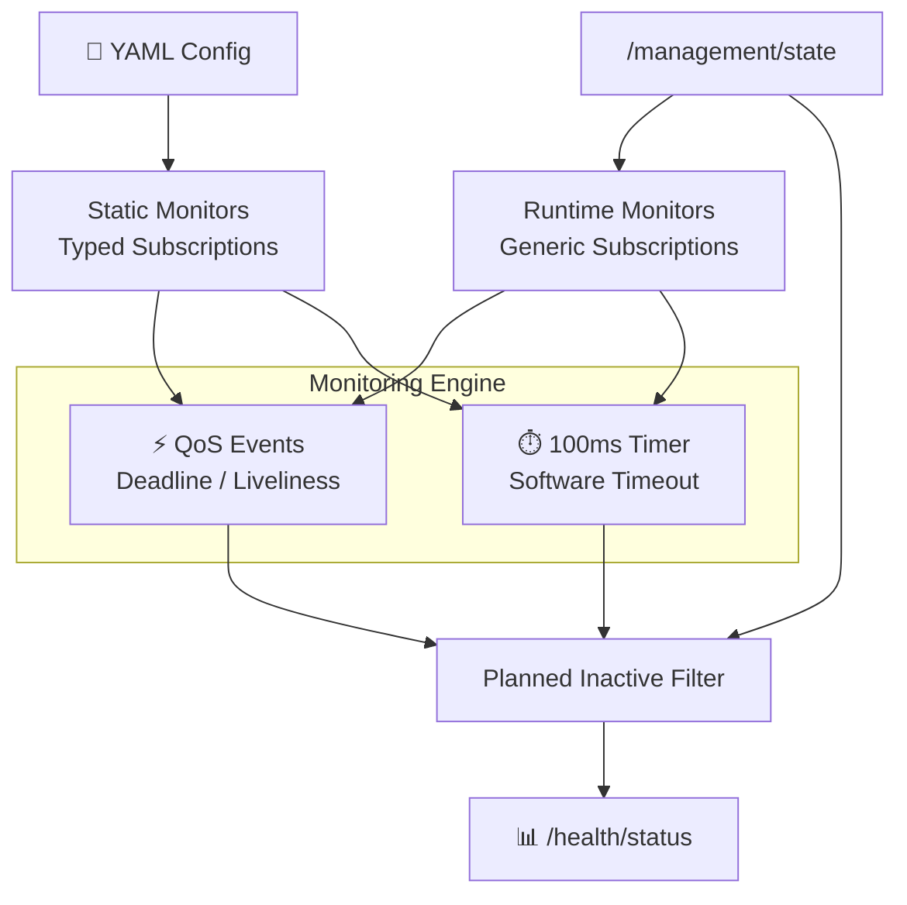
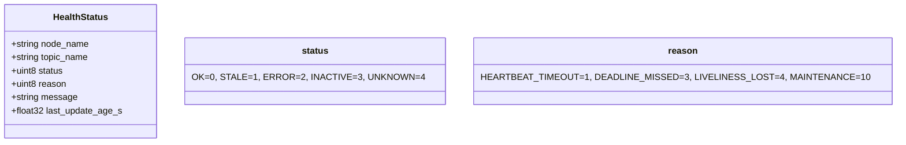
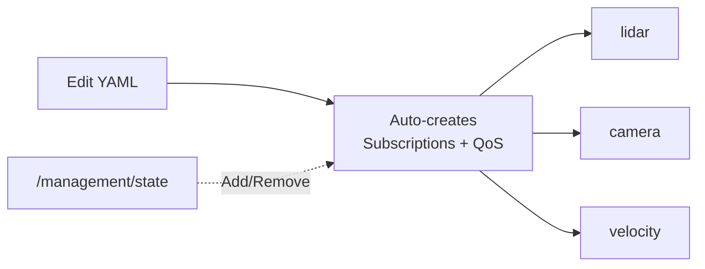
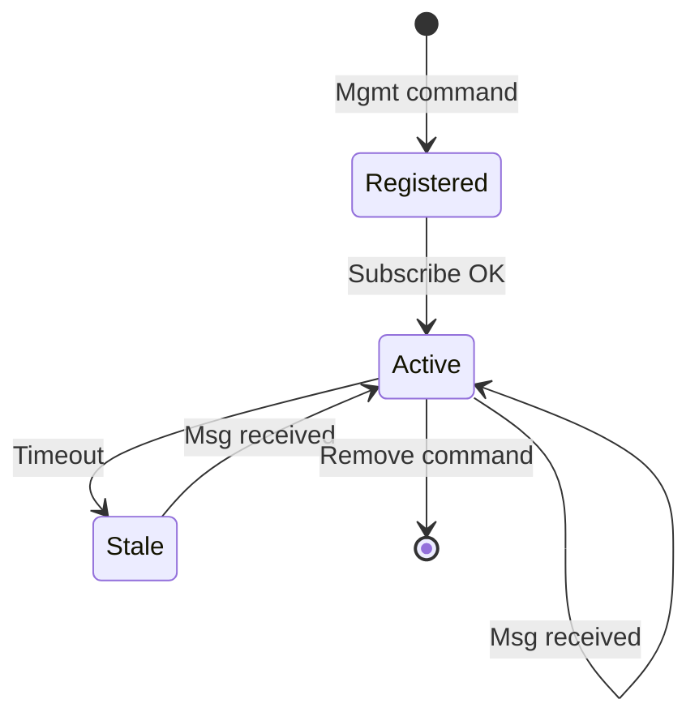
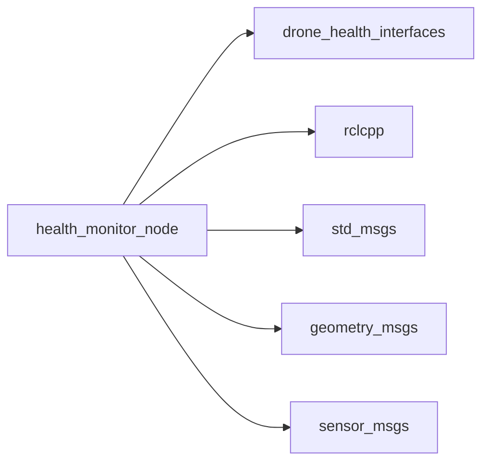

# ROS 2 Universal Health Monitor Node

A configurable, dynamic ROS 2 node that monitors topic health using **DDS QoS events** (deadlines, liveliness) + **software timeouts**, with mission-aware silencing for maintenance modes.

---

## 🏗️ Architecture



**Flow**: YAML loads static monitors at startup. `/management/state` adds/removes runtime monitors dynamically. Every monitor is checked via DDS events (instant) + wall timer (fallback). Topics marked `PLANNED_INACTIVE` are silenced.

---

## 🚀 Quick Start

```bash
colcon build --packages-select drone_health_monitor
source install/setup.bash
ros2 run drone_health_monitor health_monitor_node --ros-args --params-file config.yaml
```

```yaml
health_monitor_node:
  ros__parameters:
    check_period_ms: 100
    status_publish_period_ms: 1000
    monitor_ids: [lidar_heartbeat, vehicle_velocity, camera_image]

    lidar_heartbeat:
      node_name: lidar_node
      topic_name: /lidar/heartbeat
      kind: heartbeat
      message_type: string
      reliability: reliable
      deadline_ms: 300
      liveliness_ms: 1000
      timeout_ms: 1500

    vehicle_velocity:
      node_name: flow_node
      topic_name: /vehicle/velocity
      kind: data
      message_type: twist_stamped
      reliability: best_effort
      deadline_ms: 200
      timeout_ms: 500
   
```

---

## 📡 Interfaces

| | Topic | Type |
|---|---|---|
| **Sub** | `/management/state` | `ManagementState` — add/remove monitors, set inactive |
| **Sub** | `/lidar/heartbeat`, etc. | Various — monitored topics |
| **Pub** | `/health/status` | `HealthStatus` — OK / STALE / ERROR / INACTIVE / UNKNOWN |



---

## 🌟 Why It's Reusable

| Feature | Benefit |
|---|---|
| **YAML-only config** | Add sensors by editing config — zero code changes |
| **Generic subscriptions** | Runtime monitors work with *any* message type without recompiling |
| **Mission-aware** | Silences alerts during maintenance via `/management/state` |
| **Dual fault detection** | DDS QoS events (ms) + software timer (100ms) backup |



---

## 🔄 Runtime Monitor Lifecycle



External modules publish `ManagementState` with monitor specs → node spawns `rclcpp::GenericSubscription` on the fly.

---

## 📊 Status Codes

| Code | Meaning | Trigger |
|---|---|---|
| `0` OK | Healthy | Message received within deadline |
| `1` STALE | Timeout | No message for `timeout_ms` |
| `2` ERROR | QoS/Liveliness issue | DDS event fired |
| `3` INACTIVE | Planned silence | Topic in `planned_inactive_topics` |
| `4` UNKNOWN | First message pending | No data yet |

---

## 🛠️ Build & Run

```bash
# Build
colcon build --packages-select drone_health_monitor
source install/setup.bash

# Run
ros2 run drone_health_monitor health_monitor_node --ros-args --params-file config.yaml

# Debug
ros2 topic echo /health/status
ros2 param list /health_monitor_node
```

---

## 📦 Dependencies



---

## 📄 License

MIT License. Free to use for academic and commercial projects.
```
