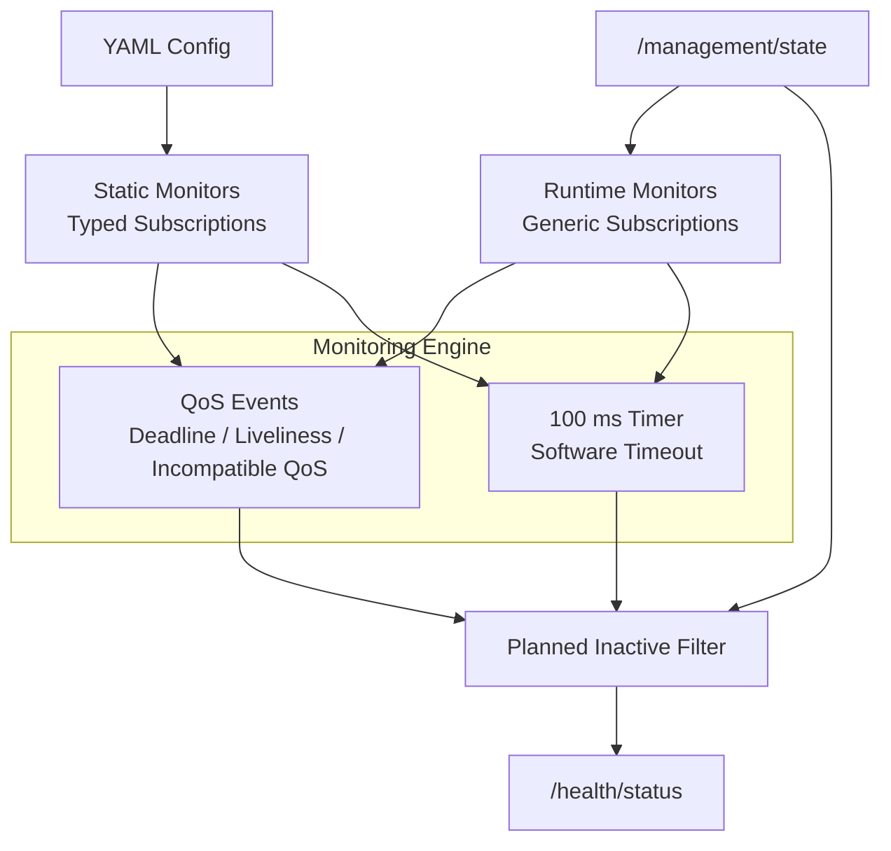
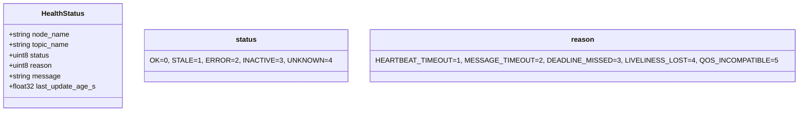
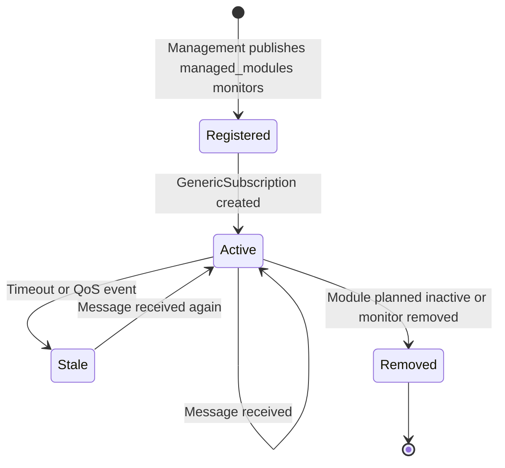
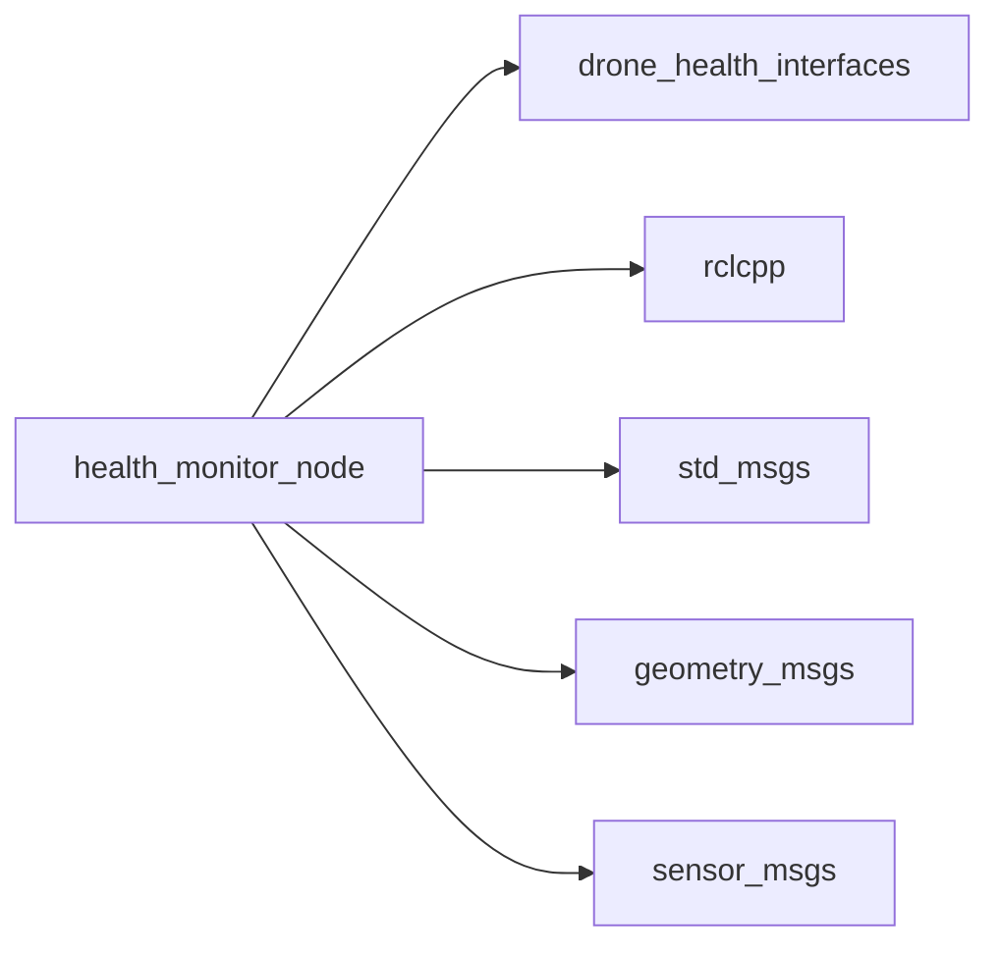

# ROS 2 Universal Health Monitor Node

A configurable ROS 2 node that monitors topic health using **DDS QoS events** (deadline, liveliness, incompatible QoS) plus **software timeout fallback**. It supports static YAML monitors and runtime monitors provided by the Management Node.

---

## Architecture



YAML loads known static monitors at startup. `/management/state` adds and removes runtime monitors dynamically from `managed_modules[].monitors`. Runtime heartbeat and data topics are monitored with `rclcpp::GenericSubscription`, so HealthMonitor can check message arrival and timeouts for future ROS message types without recompiling.

---

## Quick Start

```bash
colcon build --packages-select drone_health_core
source install/setup.bash
ros2 run drone_health_core health_monitor_node --ros-args --params-file /home/nila/Desktop/drone_health_modular_ws/src/drone_health_core/health_monitor/health_monitor.yaml
```

Example static YAML monitor configuration:

```yaml
health_monitor_node:
  ros__parameters:
    check_period_ms: 100
    status_publish_period_ms: 1000
    monitor_ids: [lidar_heartbeat, vehicle_velocity]

    lidar_heartbeat.node_name: lidar
    lidar_heartbeat.topic_name: /lidar/heartbeat
    lidar_heartbeat.kind: heartbeat
    lidar_heartbeat.message_type: string
    lidar_heartbeat.reliability: reliable
    lidar_heartbeat.deadline_ms: 300
    lidar_heartbeat.liveliness_ms: 1000
    lidar_heartbeat.timeout_ms: 1500

    vehicle_velocity.node_name: flow
    vehicle_velocity.topic_name: /vehicle/velocity
    vehicle_velocity.kind: data
    vehicle_velocity.message_type: twist_stamped
    vehicle_velocity.reliability: best_effort
    vehicle_velocity.deadline_ms: 200
    vehicle_velocity.timeout_ms: 500
```

---

## Interfaces

| Direction | Topic | Type | Purpose |
|---|---|---|---|
| Sub | `/management/state` | `ManagementState` | Runtime monitor specs and planned inactive lists |
| Sub | Configured monitor topics | Various | Static typed subscriptions and runtime generic subscriptions |
| Pub | `/health/status` | `HealthStatus` | Per-topic health report |



---

## Runtime Monitor Lifecycle



For runtime modules, each registration is treated as the module's complete current monitor list. If the same module re-registers with a changed monitor list, HealthMonitor replaces its runtime subscriptions for that module.

---

## Status Codes

| Code | Meaning | Trigger |
|---|---|---|
| `0` OK | Healthy | Message received within timeout |
| `1` STALE | Timeout | No message before `timeout_ms` |
| `2` ERROR | QoS/liveliness issue | DDS event fired |
| `3` INACTIVE | Planned silence | Static planned-inactive topic is ignored |
| `4` UNKNOWN | First message pending | No data received yet |

For runtime planned-inactive modules, HealthMonitor removes the runtime subscriptions. The dashboard removes cached health tiles for those planned-inactive modules/topics.

---

## Why It Is Reusable

| Feature | Benefit |
|---|---|
| YAML static monitors | Add known sensors by editing configuration |
| Generic runtime subscriptions | Add runtime modules with new ROS message types without changing HealthMonitor code |
| QoS + timeout checks | Detect deadline, liveliness, incompatible QoS, and simple message silence |
| Management awareness | Planned inactive modules/topics do not become false failures |

---

## Build & Debug

```bash
colcon build --packages-select drone_health_core
source install/setup.bash
ros2 run drone_health_core health_monitor_node --ros-args --params-file /home/nila/Desktop/drone_health_modular_ws/src/drone_health_core/health_monitor/health_monitor.yaml

ros2 topic echo /health/status
ros2 param list /health_monitor_node
```

---

## Dependencies



---

## License

MIT License. Free to use for academic and commercial projects.
