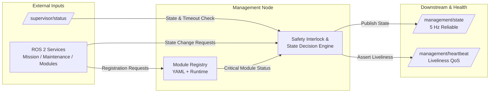

# 🛠️ ROS 2 Drone Health Management Node

[](https://docs.ros.org/)
[](https://en.cppreference.com/w/cpp/17)

A robust, central management node for autonomous drone systems that coordinates operational states, validates mission execution constraints, and tracks the dynamic lifecycle of hardware and software modules.

Situated at the core of the system autonomy stack, the Management Node acts as the definitive gatekeeper between system diagnostics (health monitoring/supervision) and mission execution. It ensures that operations never commence or continue under degraded, unmonitored, or unsafe conditions.

---

## 🏗️ System Architecture

The Management Node acts as the central state machine and interlock engine between high-level mission control, dynamic hardware/software modules, and downstream health monitors.



### Data Flow Overview
1. **Input Validation:** Subscribes to `/supervisor/status` and checks against `supervisor_status_timeout_ms` to ensure command authority is fresh and active.
2. **Registry Evaluation:** Cross-references service requests against static YAML configurations and runtime-registered modules to track critical dependencies.
3. **Interlock Enforcement:** Blocks invalid state transitions (such as starting a mission with broken critical modules or entering maintenance mid-flight).
4. **Deterministic Output:** Broadcasts unified system state at **5 Hz** to `/management/state` while asserting manual QoS liveliness to `/management/heartbeat`.

---

## ✨ Key Features

* **🛡️ Mission Safety Interlocks:** Strictly prevents mission initiation if the system is in maintenance mode, if any **critical** module/topic is marked inactive, or if the high-level Supervisor node denies command permission or times out.
* **🔌 Hybrid Module Registration:** Supports both static compile/YAML-time module declaration and dynamic runtime registration/deregistration via ROS 2 services, allowing flexible system reconfiguration.
* **⏸️ Planned Inactivity Management:** Safely handles expected module downtime (e.g., `optional_disabled`, `maintenance`, `mission_not_required`) without triggering system-wide safety aborts—unless the module is deemed critical during an active mission.
* **💓 Liveliness & Deadline QoS:** Publishes deterministic, high-frequency state updates (`5 Hz`) and asserts manual topic liveliness (`1500 ms` lease, `700 ms` deadline) to prove operational continuity to downstream monitors.

---

## 🚀 Quick Start

### 1. Build the Package
```bash
colcon build --packages-select drone_health_core
source install/setup.bash
```

### 2. Run the Node with Configuration
```bash
ros2 run drone_health_core management_node --ros-args --params-file /home/nila/Desktop/drone_health_modular_ws/src/drone_health_core/management/management.yaml
```

### 3. Monitor System Management State
```bash
ros2 topic echo /management/state
```

---

## 🧠 Mission Interlock & Decision Logic

The node enforces strict rules before allowing state transitions or module alterations during flight:

| Requested Action | Condition | Result | Output Reason |
| :--- | :--- | :--- | :--- |
| `set_mission_active(true)` | System is in Maintenance Mode | ❌ **Rejected** | `cannot start mission while maintenance mode is active` |
| `set_mission_active(true)` | Any Critical Module/Topic is Planned Inactive | ❌ **Rejected** | `cannot start mission while critical module/topic is planned inactive` |
| `set_mission_active(true)` | Supervisor heartbeat stale or command disallowed | ❌ **Rejected** | `cannot start mission because supervisor does not allow command` |
| `set_module_inactive(true)` | Module is `critical` AND Mission is Active | ❌ **Rejected** | `cannot mark critical module inactive during active mission` |
| `set_maintenance_mode(true)` | Mission is currently Active | ❌ **Rejected** | `cannot enable maintenance mode during active mission` |

---

## ⚙️ Configuration Guide

Configure baseline system modules, criticalities, and supervisor timeouts via YAML:

```yaml
management_node:
  ros__parameters:
    supervisor_status_topic: /supervisor/status
    supervisor_status_timeout_ms: 1000

    module_ids:
      - lidar
      - flow
      - safety
      - health
      - supervisor
      - camera

    # Critical sensor required for flight
    lidar.critical: true
    lidar.topics:
      - /lidar/scan
      - /lidar/heartbeat
      - /lidar/nearest_obstacle

    # Non-critical payload module
    camera.critical: false
    camera.topics:
      - /camera/image_raw
      - /camera/heartbeat
```

### Parameter Definitions
| Parameter | Description |
| :--- | :--- |
| `supervisor_status_topic` | Topic where the high-level system supervisor publishes state reports. |
| `supervisor_status_timeout_ms`| Max allowed age of supervisor status before mission commands are locked out. |
| `module_ids` | List of string identifiers for statically configured system modules. |
| `<id>.critical` | Whether the module's health is strictly required to start/maintain missions. |
| `<id>.topics` | List of ROS 2 topics associated with this specific hardware/software module. |

---

## 📡 ROS 2 Interfaces

### Subscriptions & Publishers
| Topic | Type | Direction | Description |
| :--- | :--- | :--- | :--- |
| `/supervisor/status` | `SupervisorStatus` | **In** | High-level system state and mission authorization. |
| `/management/state` | `ManagementState` | **Out** | Comprehensive status of all managed modules, reasons, and mission flags (`5 Hz`). |
| `/management/heartbeat` | `std_msgs/String` | **Out** | Node health heartbeat with deadline (`700ms`) and manual liveliness QoS (`1500ms`). |

### Services Exposed
| Service Name | Service Type | Description |
| :--- | :--- | :--- |
| `/management/set_maintenance_mode` | `std_srvs/SetBool` | Toggles system maintenance mode (blocked during active missions). |
| `/management/set_mission_active` | `std_srvs/SetBool` | Requests mission start/stop (subject to safety interlocks). |
| `/management/set_module_inactive` | `SetModuleInactive` | Temporarily suppresses health warnings for a registered module. |
| `/management/register_module` | `RegisterModule` | Dynamically registers a new module and its topic QoS specifications at runtime. |
| `/management/deregister_module` | `DeregisterModule` | Gracefully removes or deactivates a module from active system supervision. |

---

## 📄 License
MIT License. Free to use for academic and commercial robotics projects.
