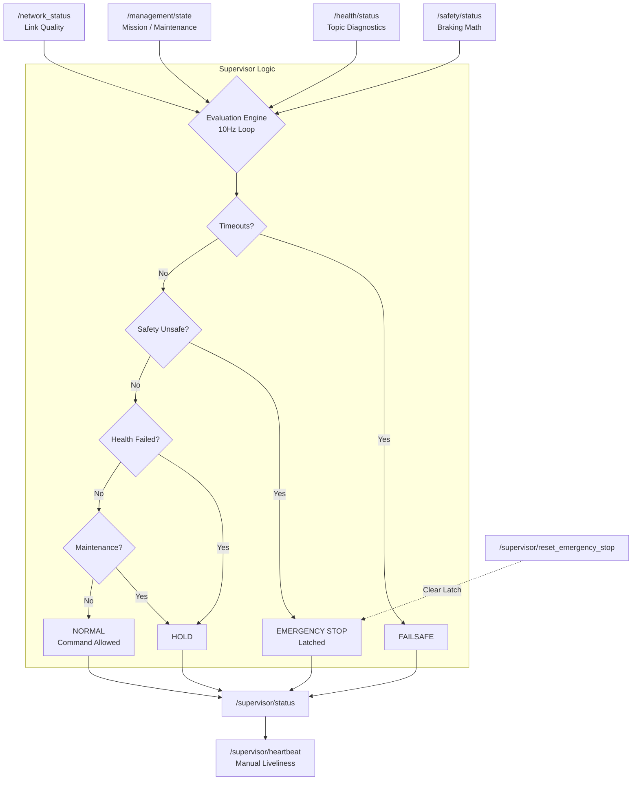
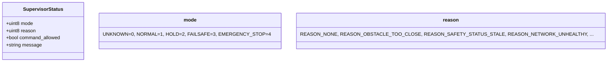
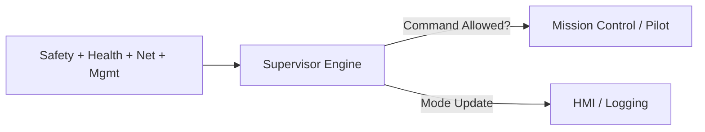
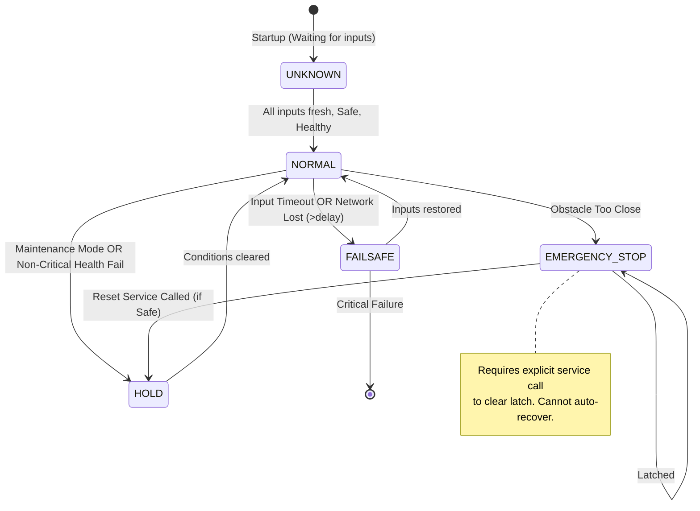
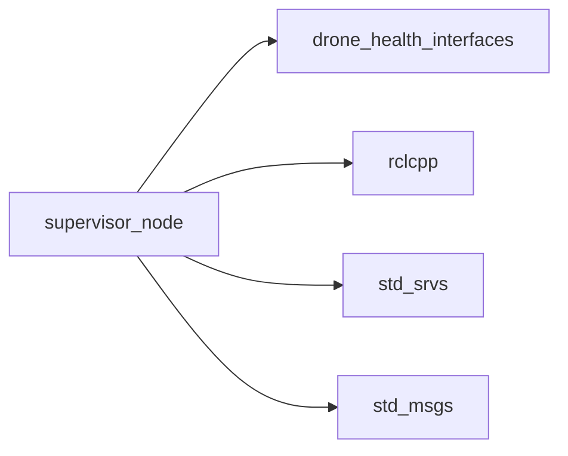

# ROS 2 Autonomous Supervisor Node

A high-level decision-making node that fuses **Safety Status**, **System Health**, **Network Connectivity**, and **Management State** to determine global system authorization. It acts as the final "Go/No-Go" gatekeeper, enforcing strict failsafes, latched emergency stops, and network-dependent hold modes.

---

## 🏗️ Architecture



**Flow**: The node runs a 10Hz evaluation loop. It checks input freshness first (timeouts → Failsafe). Then it checks physical safety (obstacles → Latched E-Stop). Finally, it validates system health and network status. Commands are only allowed in `NORMAL` mode.

---

## 🚀 Quick Start

```bash
colcon build --packages-select drone_health_core
source install/setup.bash
ros2 run drone_health_core supervisor_node --ros-args --params-file /home/nila/Desktop/drone_health_modular_ws/src/drone_health_core/supervisor/supervisor.yaml
```

```yaml
supervisor_node:
  ros__parameters:
    # --- Topics ---
    safety_status_topic: /safety/status
    health_status_topic: /health/status
    management_state_topic: /management/state
    network_status_topic: /network_status
    supervisor_status_topic: /supervisor/status
    heartbeat_topic: /supervisor/heartbeat

    # --- Timing ---
    evaluation_period_ms: 100
    safety_status_timeout_ms: 500
    health_status_timeout_ms: 1500
    management_state_timeout_ms: 1500
    network_status_timeout_ms: 3000
    network_failsafe_delay_ms: 10000  # Grace period before Failsafe on net loss

    # --- Heartbeat QoS ---
    heartbeat_period_ms: 500
    heartbeat_deadline_ms: 700
    heartbeat_liveliness_ms: 1500

    # --- Critical Dependencies ---
    required_health_topics:
      - /lidar/scan
      - /vehicle/velocity
      - /safety_fusion/heartbeat
```

---

## 📡 Interfaces

| | Topic/Service | Type | Description |
|---|---|---|---|
| **Sub** | `/safety/status` | `SafetyStatus` | Braking distance & obstacle verdict. |
| **Sub** | `/health/status` | `HealthStatus` | Individual topic health reports. |
| **Sub** | `/management/state` | `ManagementState` | Mission active flag & planned inactive lists. |
| **Sub** | `/network_status` | `std_msgs/String` | Network link state (`NETWORK_HEALTHY`, `LOST`, etc.). |
| **Pub** | `/supervisor/status` | `SupervisorStatus` | **Global System Mode** & Command Authorization. |
| **Pub** | `/supervisor/heartbeat` | `std_msgs/String` | Node liveliness with Deadline/Liveliness QoS. |
| **Srv** | `/supervisor/reset_emergency_stop` | `std_srvs/Trigger` | Clears latched E-Stop (only if system is safe). |



---

## 🌟 Why It's Reusable

| Feature | Benefit |
|---|---|
| **Latched Emergency Stop** | Once triggered by an obstacle, the system stays stopped until explicitly reset *and* verified safe. |
| **Network Grace Period** | Distinguishes between temporary packet loss (`HOLD`) and total comms failure (`FAILSAFE`) via configurable delay. |
| **Dynamic Health Awareness** | Automatically ignores health failures for topics marked `PLANNED_INACTIVE` by the Management Node. |
| **Deterministic Liveliness** | Uses manual DDS liveliness assertion so downstream nodes detect supervisor crashes instantly. |



---

## 🔄 Global Mode State Machine



---

## 📊 Mode Decision Logic

| Current Condition | Resulting Mode | Command Allowed? | Reason Code |
|---|---|---|---|
| Missing Safety/Health/Net data (Timeout) | **FAILSAFE** | ❌ No | `REASON_..._STALE` |
| Safety Status = `UNSAFE` (Obstacle) | **EMERGENCY_STOP** | ❌ No | `REASON_OBSTACLE_TOO_CLOSE` |
| E-Stop Latched (Pending Reset) | **EMERGENCY_STOP** | ❌ No | `REASON_OBSTACLE_TOO_CLOSE` |
| Required Health Topic Failed | **HOLD** (or FAILSAFE if mission active) | ❌ No | `REASON_REQUIRED_HEALTH_FAILED` |
| Network Lost (> `failsafe_delay_ms`) | **FAILSAFE** | ❌ No | `REASON_NETWORK_UNHEALTHY` |
| Network Lost (< `failsafe_delay_ms`) | **HOLD** | ❌ No | `REASON_NETWORK_UNHEALTHY` |
| Maintenance Mode Active | **HOLD** | ❌ No | `REASON_MAINTENANCE_MODE` |
| All Systems Green | **NORMAL** | ✅ **Yes** | `REASON_NONE` |

---

## 🛠️ Build & Run

```bash
# Build
colcon build --packages-select drone_health_core
source install/setup.bash

# Run
ros2 run drone_health_core supervisor_node --ros-args --params-file /home/nila/Desktop/drone_health_modular_ws/src/drone_health_core/supervisor/supervisor.yaml

# Debug
ros2 topic echo /supervisor/status
ros2 service call /supervisor/reset_emergency_stop std_srvs/srv/Trigger "{}"
```

---

## 📦 Dependencies



---

## 📄 License

MIT License. Free to use for academic and commercial projects.
