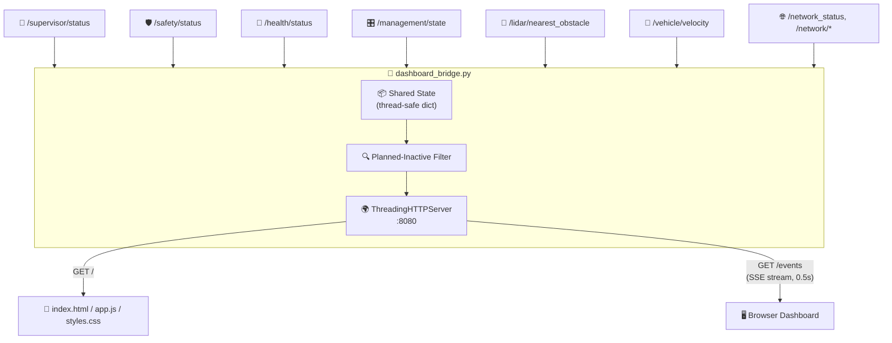
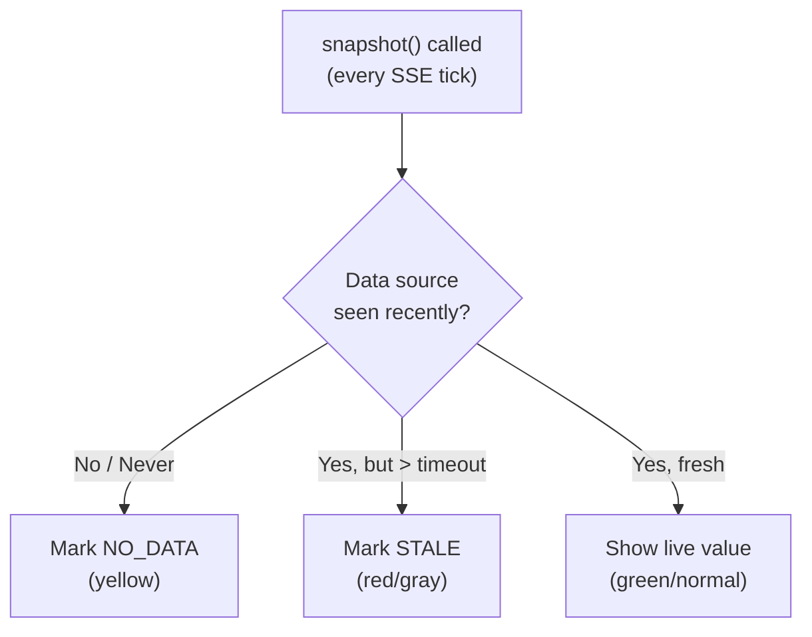
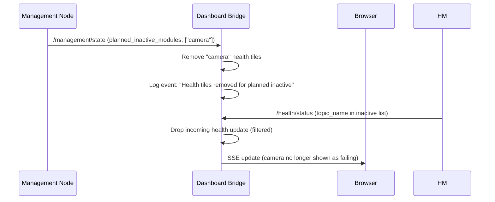
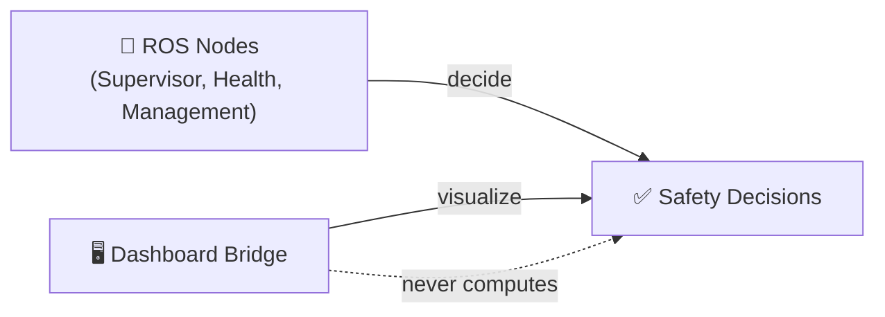
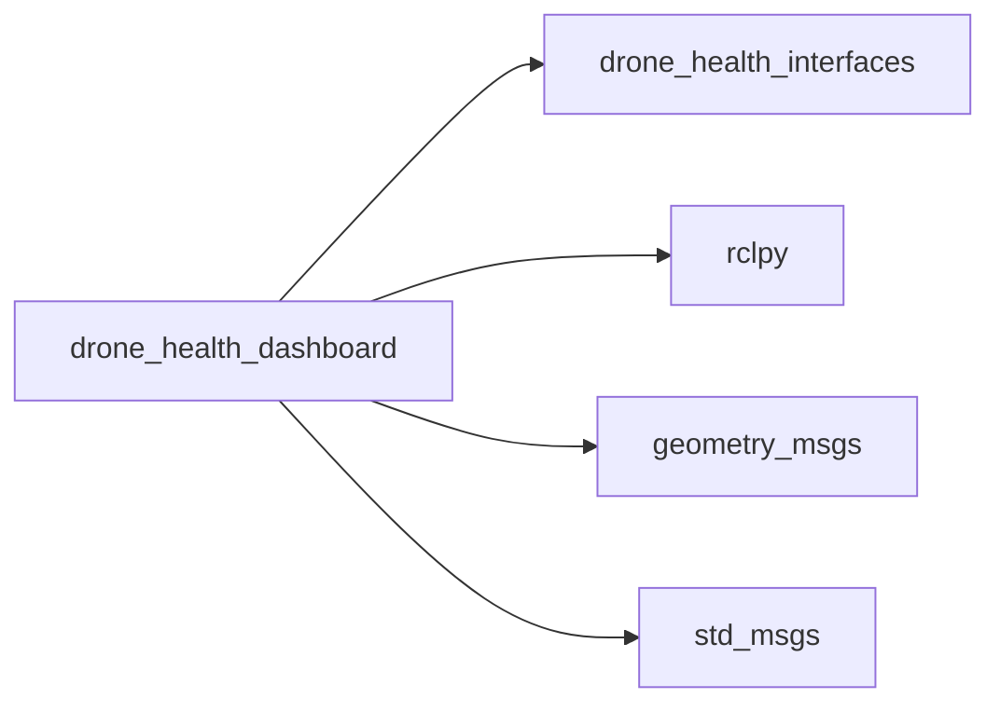

# 🖥️ ROS 2 Drone Health Dashboard

[](https://docs.ros.org/)
[](https://www.python.org/)

A real-time web dashboard for the Drone Health Monitoring Framework. A lightweight Python bridge subscribes to all ROS 2 health/safety topics and streams live updates to a browser frontend via Server-Sent Events (SSE) — no build pipeline required.

---

## 🏗️ Architecture



**Flow**: ROS callbacks update a shared, lock-protected state dictionary. Health entries for modules/topics marked `planned_inactive` by the Management Node are automatically filtered out. A background `ThreadingHTTPServer` serves the static frontend and streams the state as Server-Sent Events every 500ms. The browser never talks to ROS directly — only to this HTTP bridge.

---

## 📦 Package Contents

```
drone_health_dashboard/
├── scripts/
│   └── dashboard_bridge.py   ← ROS subscriber + HTTP/SSE server
├── web/
│   ├── index.html
│   ├── styles.css
│   └── app.js
└── package.xml
```

---

## 🚀 Build & Run

```bash
colcon build --packages-select drone_health_dashboard
source install/setup.bash
ros2 run drone_health_dashboard dashboard_bridge.py
```

Then open:
```
http://localhost:8080
```

### Custom Port
```bash
ros2 run drone_health_dashboard dashboard_bridge.py --ros-args -p web_port:=9090
```

---

## 📡 Subscribed Topics

| Topic | Type | Drives |
|---|---|---|
| `/supervisor/status` | `SupervisorStatus` | Global mode badge (NORMAL/HOLD/FAILSAFE/E-STOP) |
| `/safety/status` | `SafetyStatus` | Braking math panel |
| `/health/status` | `HealthStatus` | Per-topic health table |
| `/management/state` | `ManagementState` | Mission/maintenance + module registry |
| `/lidar/nearest_obstacle` | `Float32` | Obstacle distance metric |
| `/vehicle/velocity` | `TwistStamped` | Speed + velocity components |
| `/network_status`, `/network/wifi/*`, `/network/lte/*`, `/network/at_hilink/*` | various | Network panel |

---

## 🌟 Key Features

| Feature | Benefit |
|---|---|
| **Server-Sent Events (SSE)** | Live updates without WebSocket complexity or polling overhead. |
| **No build step** | Plain HTML/CSS/JS served directly — no compiler/bundler required. |
| **Staleness detection** | Each data source has its own timeout; stale data turns gray/red automatically. |
| **Planned-inactive filtering** | Health tiles for deregistered/inactive modules are removed instead of showing as failures. |
| **Event log** | Tracks state transitions (Supervisor mode changes, health status flips) as a scrolling feed. |
| **Thread-safe state** | Single lock-protected dict shared between ROS callbacks and the HTTP server thread. |
| **Read-only by design** | The bridge only visualizes — it never makes safety decisions. |

---

## 🛡️ Staleness & Failure Detection



| Source | Timeout | Stale Behavior |
|---|---|---|
| Supervisor | 1.5s | Mode → `STALE`, color → red |
| Safety | 1.5s | State → `STALE`, color → red |
| Management | 2.0s | Reason → `STALE` |
| Health | 2.0s | All entries → `STALE`, color → gray, logs one event |
| Network | 3.0s | Status → `STALE` |
| Obstacle/Velocity | 1.5s | Metric → `null` (hidden) |

---

## 🔌 Planned-Inactive Handling



When the Management Node reports a module or topic as `planned_inactive`, the bridge:
1. Immediately removes any existing health tile for it.
2. Silently drops future health updates for that module/topic.
3. Logs a single grouped event instead of spamming individual removals.

This prevents the dashboard from showing deregistered/maintenance modules as red failures.

---

## 🎨 Color Coding Convention

| Color | Meaning |
|---|---|
| 🟢 Green | Healthy / Normal / Safe |
| 🟡 Yellow | Unknown / Waiting / Degraded |
| ⚪ Gray | Inactive / Stale (no data) |
| 🔴 Red | Error / Unsafe / Failsafe |

---

## 🧬 Architecture Rule

> **The dashboard never decides — it only displays.**



All `SAFE/UNSAFE`, `NORMAL/HOLD/FAILSAFE`, and health status decisions are made **upstream** by the core ROS nodes. This package only translates ROS messages into JSON for human viewing and forwards user commands as service calls.

---

## 🛡️ Failure Behavior

| Scenario | Dashboard Behavior |
|---|---|
| **Bridge process stops** | Browser SSE connection drops → frontend should show "disconnected" state. |
| **A ROS node stops (e.g. Supervisor)** | Bridge detects staleness via timeout → tile turns `STALE` / red, not silently frozen. |
| **Module deregisters gracefully** | Health tile is removed cleanly — no false alarm. |
| **Module crashes without deregistering** | Health tile turns red/`STALE` via the normal Health Monitor pipeline. |

---

## 🛠️ Debug

```bash
# Confirm the bridge is receiving data
ros2 topic echo /supervisor/status

# Check the raw SSE stream
curl http://localhost:8080/events

# Check static files are served
curl http://localhost:8080/
```

---

## 📦 Dependencies



---

## 📄 License

MIT License. Free to use for academic and commercial projects.
