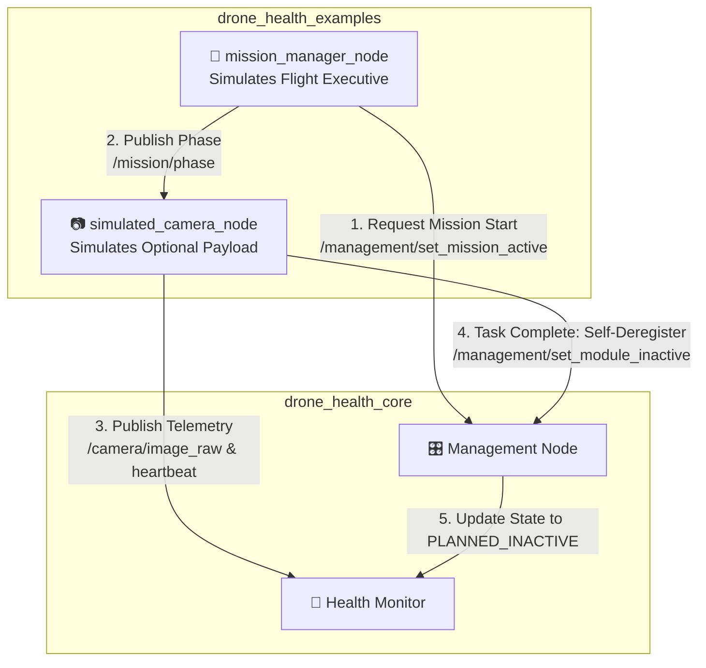

# drone_health_examples

[](https://docs.ros.org/)
[](https://en.cppreference.com/w/cpp/17)

An educational and integration reference package containing demonstration nodes for the **Drone Health Monitoring Framework**. 

These nodes illustrate practical implementation patterns for **optional payload management**, **high-level mission state requests**, and **dynamic self-deregistration**. They are designed for testing, simulation, and teaching workflows and are **not required** for core system autonomy.

---

## 🏗️ Example Interaction Architecture

This diagram illustrates how the demo nodes interact with the production core framework (`drone_health_core`) during a typical mission simulation:



---

## 📦 Included Nodes

| Node Name | Simulated Role | Key Behavior Demonstrated |
| :--- | :--- | :--- |
| **`mission_manager_node`** | Flight Executive / Behavior Tree | Requests active mission state from the Management Node and publishes timed operational phases (`IDLE`, `INSPECTION`, `INSPECTION_COMPLETE`, `NAVIGATION_CONTINUE`). |
| **`simulated_camera_node`** | Optional Inspection Payload | Generates synthetic RGB images and heartbeats. Listens to mission phases and executes a **planned self-deregistration** exit when inspection tasks finish. |

---

## 🚀 Quick Start

### 1. Build the Package
Ensure the core interface and management packages are built first, then compile the examples:
```bash
colcon build --packages-select drone_health_examples
source install/setup.bash
```

### 2. Run the Demo Sequence
To see the full framework in action, run the central **Management Node** in one terminal, followed by the two example nodes in separate terminals:

**Terminal 1: Start the Core Management Node**
```bash
ros2 run drone_health_core management_node --ros-args --params-file install/drone_health_core/share/drone_health_core/management/management.yaml
```

**Terminal 2: Launch the Simulated Camera**
```bash
ros2 run drone_health_examples simulated_camera_node
```

**Terminal 3: Launch the Mission Manager**
```bash
ros2 run drone_health_examples mission_manager_node
```

---

## 🎭 Walkthrough of the Demo Workflow

When both example nodes run alongside the core framework, you can observe the following automated sequence:

1. **Mission Initialization (`0s - 5s`)**: 
   * `mission_manager_node` boots up in `IDLE` and counts down its startup delay.
   * `simulated_camera_node` actively publishes synthetic images and asserts liveliness.
2. **Inspection Phase (`5s - 55s`)**: 
   * The mission manager requests `mission_active = true` via ROS 2 service.
   * Phase updates to `INSPECTION`. The camera continues generating inspection data.
3. **Graceful Payload Exit (`55s+`)**: 
   * Phase transitions to `INSPECTION_COMPLETE`.
   * The camera detects task completion and calls `/management/set_module_inactive` with `reason: "deregistered"`.
   * The camera shuts down cleanly. Management shows the camera as `PLANNED_INACTIVE`, and the dashboard removes camera health tiles instead of showing a false failure.
4. **Mission Continuation**: 
   * Phase updates to `NAVIGATION_CONTINUE`. The drone continues flight without triggering safety alarms over the missing camera.

---

## 🛡️ Core Framework Independence

A design goal of this architecture is **loose coupling**. The core safety framework does not depend on these demo nodes:

* **If `mission_manager_node` is missing:** The system remains in standby (`mission_active = false`). You can manually command the mission state via CLI:
  ```bash
  ros2 service call /management/set_mission_active std_srvs/srv/SetBool "{data: true}"
  ```
* **If `simulated_camera_node` crashes unexpectedly:** Because it did not execute a planned deregistration handshake, the `HealthMonitor` will correctly catch the missing heartbeat and flag the topic as `STALE` or `ERROR`.

---

## 📄 License
MIT License. Free to use for academic and commercial robotics projects.
