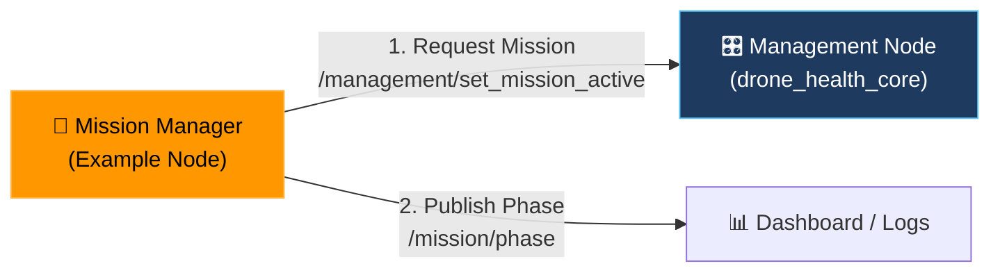
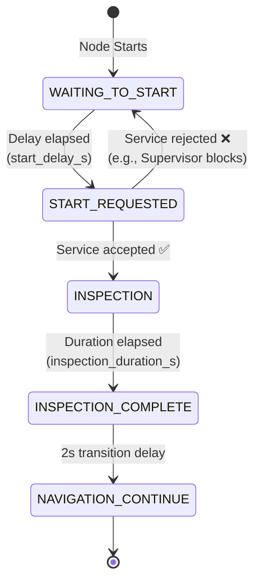

# 🚁 ROS 2 Mission Manager Example Node

[](https://docs.ros.org/)
[](https://en.cppreference.com/w/cpp/17)

A simple demonstration node that simulates an external autonomy stack requesting mission activation from the core health framework and publishing its current mission phase. 

> ⚠️ **Note:** This is an **example/teaching node** included in `drone_health_examples`. It is **not** part of the core safety framework. In a real system, this node would be replaced by PX4/ArduPilot, a behavior tree, or a custom autonomy stack.

---

## 🏗️ Architecture & Integration



**Flow**: The node waits for a configurable startup delay, then calls the Management Node's `set_mission_active` service. If accepted, it cycles through simulated mission phases (Inspection -> Complete -> Navigation) while publishing its status.

---

## 🔄 Internal State Machine



---

## 📡 Interfaces

### Published Topics
| Topic | Type | Description |
|---|---|---|
| `/mission/phase` | `std_msgs/String` | Current mission phase (`IDLE`, `INSPECTION`, `INSPECTION_COMPLETE`, `NAVIGATION_CONTINUE`) |

### Service Clients
| Service | Type | Description |
|---|---|---|
| `/management/set_mission_active` | `std_srvs/SetBool` | Requests the core Management Node to enable mission mode. |

---

## ⚙️ Parameters

| Parameter | Type | Default | Description |
|---|---|---|---|
| `publish_period_ms` | int | `500` | How often to publish the current mission phase. |
| `start_delay_s` | int | `5` | Seconds to wait after startup before requesting mission start. |
| `inspection_duration_s` | int | `50` | Seconds to simulate the "inspection" phase before completing it. |

---

## 🚀 Build & Run

### Build
```bash
colcon build --packages-select drone_health_examples
source install/setup.bash
```

### Run
```bash
ros2 run drone_health_examples mission_manager_node
```

### Run with Custom Parameters
```bash
ros2 run drone_health_examples mission_manager_node --ros-args \
  -p start_delay_s:=2 \
  -p inspection_duration_s:=10
```

### Monitor Output
```bash
# Watch the mission phases
ros2 topic echo /mission/phase

# Watch the service calls being accepted/rejected
ros2 topic echo /management/state
```

---

## 🛡️ Failure & Edge Case Behavior

* **Service Not Ready:** If the Management Node isn't running, the Mission Manager will log a warning and retry until the service becomes available.
* **Request Rejected:** If the Supervisor/Management Node rejects the mission start (e.g., due to `maintenance_mode` or unhealthy sensors), the Mission Manager gracefully falls back to `WAITING_TO_START` and will retry.
* **Node Crash:** If this node crashes, the core health framework continues to operate perfectly. Mission state can still be toggled manually via CLI:
  ```bash
  ros2 service call /management/set_mission_active std_srvs/srv/SetBool "{data: true}"
  ```

---

## 🌍 Real-World Context

In a production drone, you would **delete this node** and replace it with your actual autonomy system. Your real system would:
1. Listen to `/supervisor/status` to ensure `command_allowed == true`.
2. Call `/management/set_mission_active` when the operator initiates the flight.
3. Publish actual flight phases (Takeoff, Waypoint Nav, Landing) to `/mission/phase` for the dashboard.

---

## 📄 License

MIT License. Free to use for academic and commercial projects.
