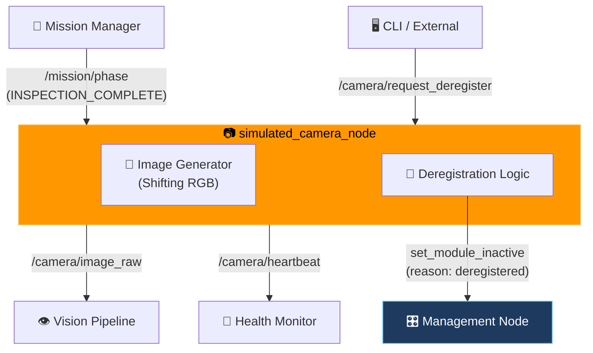
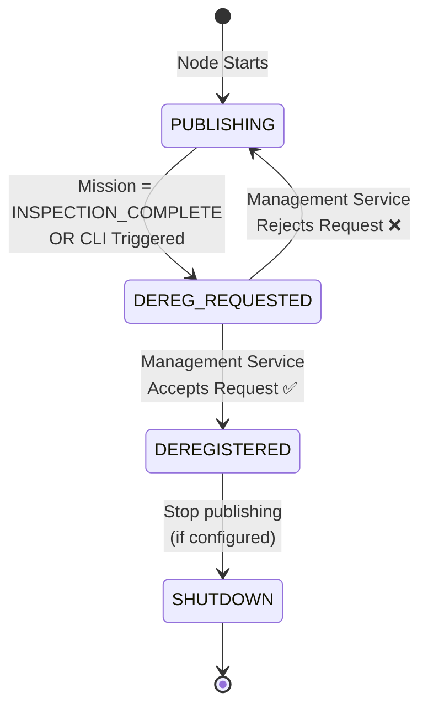

# 📷 ROS 2 Simulated Camera & Self-Deregistration Example

[](https://docs.ros.org/)
[](https://en.cppreference.com/w/cpp/17)

A simulated optional payload node that demonstrates **graceful self-deregistration** from the drone health framework. 

> ⚠️ **Note:** This is an **example/teaching node** included in `drone_health_examples`. It proves that optional modules can officially leave the monitored system when their task is complete, preventing the Health Monitor from falsely reporting them as "failed" or "stale".

---

## 🏗️ Architecture & Integration



**Flow**: The camera publishes simulated images and a DDS heartbeat. When the mission phase reaches `INSPECTION_COMPLETE` (or an external trigger is called), the camera requests to be marked inactive via the Management Node. Once acknowledged, it stops publishing and shuts down gracefully.

---

## 🔄 Internal State Machine



---

## 📡 Interfaces

### Published Topics
| Topic | Type | QoS | Description |
|---|---|---|---|
| `/camera/image_raw` | `sensor_msgs/Image` | Best Effort, Deadline | Simulated RGB images (shifting colors). |
| `/camera/heartbeat` | `std_msgs/String` | Reliable, Deadline, Liveliness | DDS heartbeat for the Health Monitor. |

### Subscribed Topics
| Topic | Type | Description |
|---|---|---|
| `/mission/phase` | `std_msgs/String` | Listens for `INSPECTION_COMPLETE` to trigger self-deregistration. |

### Services
| Service | Type | Direction | Description |
|---|---|---|---|
| `/camera/request_deregister` | `std_srvs/Trigger` | Server | Allows external tools to manually trigger graceful shutdown. |
| `/management/set_module_inactive` | `SetModuleInactive` | Client | Calls the Management Node to officially deregister. |

---

## ⚙️ Parameters

| Parameter | Type | Default | Description |
|---|---|---|---|
| `frame_id` | string | `camera_link` | TF frame ID for the image header. |
| `publish_period_ms` | int | `100` | Image and heartbeat publish rate (10Hz). |
| `image_deadline_ms` | int | `250` | DDS deadline for the image topic. |
| `heartbeat_deadline_ms` | int | `700` | DDS deadline for the heartbeat. |
| `heartbeat_liveliness_ms` | int | `1500` | DDS liveliness lease for the heartbeat. |
| `image_width` | int | `160` | Simulated image width. |
| `image_height` | int | `120` | Simulated image height. |

---

## 🚀 Build & Run

### Build
```bash
colcon build --packages-select drone_health_examples
source install/setup.bash
```

### Run
```bash
ros2 run drone_health_examples simulated_camera_node
```

### Test Graceful Deregistration
While the node is running, trigger the deregistration manually:
```bash
ros2 service call /camera/request_deregister std_srvs/srv/Trigger "{}"
```

### Monitor the Results
```bash
# Watch the camera stop publishing
ros2 topic hz /camera/image_raw

# Watch Management record planned inactive and the dashboard remove camera health tiles
ros2 topic echo /management/state
```

---

## 🛡️ Graceful Exit vs. Unexpected Failure

This node is specifically designed to teach the difference between a **fault** and a **planned exit**:

| Scenario | What Happens | Health Monitor Verdict |
|---|---|---|
| **Node Crashes / Killed** | Heartbeat and images stop abruptly. | 🔴 **STALE / ERROR** (Triggers Supervisor HOLD/FAILSAFE if critical) |
| **Graceful Deregistration** | Node calls `set_module_inactive` before stopping. | Management marks camera planned inactive; dashboard removes camera health tiles so no false alarm is shown. |

---

## 🌍 Real-World Context

In a physical drone, this pattern is used for:
* **Jettisonable payloads** (e.g., a drop mechanism that detaches mid-flight).
* **Removable inspection cameras** that power down after a specific waypoint is reached to save battery.
* **Secondary communication links** that are only active in certain geographic zones.

By using the `set_module_inactive` service, the autonomy stack tells Management that this is expected downtime. Because the camera is statically configured in YAML, rerunning it after deregistration requires an operator restore command before Health Monitor treats it as active again.

---

## 📄 License

MIT License. Free to use for academic and commercial projects.
