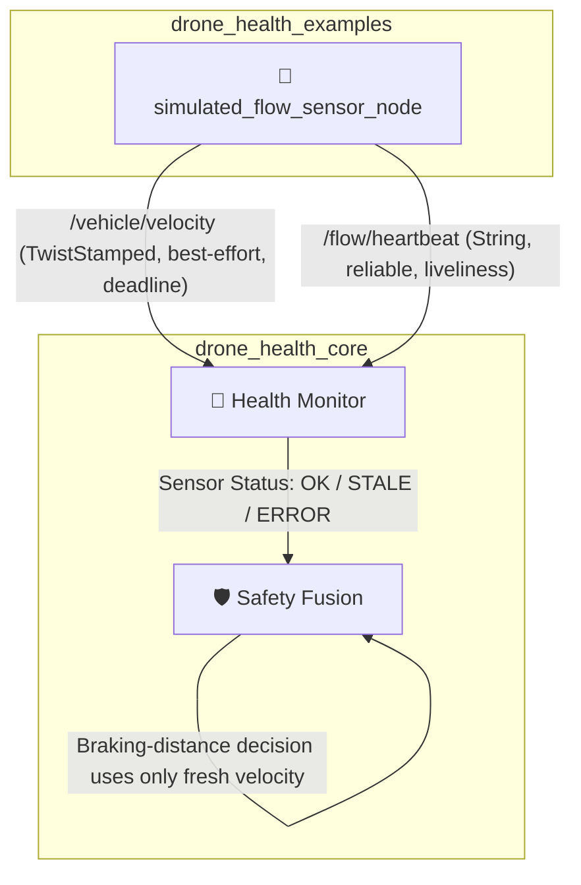

# simulated_flow_sensor_node

[](https://docs.ros.org/)
[](https://en.cppreference.com/w/cpp/17)

A demonstration node that simulates an optical-flow / velocity sensor for the **Drone Health Monitoring Framework**. It publishes synthetic vehicle velocity and a heartbeat signal with realistic QoS deadlines and liveliness, allowing the `HealthMonitor` and `SafetyFusion` nodes to be exercised against both healthy and degraded sensor conditions without real flight hardware.

---

## 🏗️ Role in the Health Monitoring Architecture



The node exists purely to **feed realistic, configurable telemetry** into the health-monitoring pipeline so that deadline-miss handling, liveliness loss, and stale-data rejection can be validated end-to-end.

---

## 🎯 Purpose

Publishes simulated vehicle velocity and a heartbeat topic, with QoS settings (deadlines + liveliness lease) that mirror what a real flow/velocity sensor driver would provide. This allows downstream health and safety nodes to be tested for:

- Deadline-miss detection on `/vehicle/velocity`
- Liveliness loss detection on `/flow/heartbeat`
- Correct rejection of stale velocity data in braking-distance calculations

---

## 📥 Inputs

None. This is a self-contained data source for simulation/testing.

## 📤 Outputs

| Topic | Type | QoS |
| :--- | :--- | :--- |
| `/vehicle/velocity` | `geometry_msgs/msg/TwistStamped` | Best-effort, `KeepLast(5)`, deadline = `velocity_deadline_ms` |
| `/flow/heartbeat` | `std_msgs/msg/String` | Reliable, `KeepLast(10)`, deadline = `heartbeat_deadline_ms`, manual-by-topic liveliness, lease = `heartbeat_liveliness_ms` |

---

## ⚙️ Parameters

| Parameter | Type | Default | Description |
| :--- | :--- | :--- | :--- |
| `frame_id` | string | `base_link` | Frame ID stamped on `TwistStamped` messages |
| `publish_period_ms` | int | `100` | Timer period for publishing velocity + heartbeat |
| `velocity_deadline_ms` | int | `200` | QoS deadline for `/vehicle/velocity` (must be > `publish_period_ms`) |
| `heartbeat_deadline_ms` | int | `300` | QoS deadline for `/flow/heartbeat` |
| `heartbeat_liveliness_ms` | int | `1000` | Liveliness lease duration for `/flow/heartbeat` (must be > `heartbeat_deadline_ms`) |
| `base_forward_velocity_mps` | double | `1.0` | Base forward speed used when `simulate_motion:=true` |
| `side_drift_amplitude_mps` | double | `0.2` | Amplitude of simulated lateral drift when `simulate_motion:=true` |
| `simulate_motion` | bool | `false` | Toggles between stationary output and oscillating motion simulation |
| `stationary_speed_mps` | double | `0.0` | Reserved for stationary forward speed when `simulate_motion:=false` |

> ⚠️ Constructor validation will throw at startup if:
> - `publish_period_ms <= 0`
> - `velocity_deadline_ms <= publish_period_ms`
> - `heartbeat_deadline_ms <= 0`
> - `heartbeat_liveliness_ms <= heartbeat_deadline_ms`

---

## 🚀 Run Commands

**Default (stationary) mode:**
```bash
ros2 run drone_health_flow_example simulated_flow_sensor_node
```

**Motion simulation mode (for safety/braking-distance testing):**
```bash
ros2 run drone_health_flow_example simulated_flow_sensor_node --ros-args -p simulate_motion:=true
```

**Custom QoS / rate example:**
```bash
ros2 run drone_health_flow_example simulated_flow_sensor_node --ros-args \
  -p publish_period_ms:=50 \
  -p velocity_deadline_ms:=120 \
  -p heartbeat_deadline_ms:=200 \
  -p heartbeat_liveliness_ms:=600
```

---

## 🎭 Expected Behavior

### Stationary mode (default)
```text
linear.x = 0.0
linear.y = 0.0
linear.z = 0.0
```
The sensor still publishes at the configured rate and asserts liveliness, simulating a healthy, idle vehicle.

### Motion simulation mode (`simulate_motion:=true`)
```text
linear.x = base_forward_velocity_mps + 0.3 * sin(t * 0.5)
linear.y = side_drift_amplitude_mps * sin(t)
linear.z = 0.0
```
Produces a smoothly oscillating forward velocity with periodic lateral drift — useful for exercising filters, braking-distance estimators, and safety thresholds in `SafetyFusion`.

In both modes, `/flow/heartbeat` is published every cycle and `assert_liveliness()` is called immediately after, so a healthy run should never trigger a liveliness lease expiration on the `HealthMonitor` side.

---

## 🛑 Failure Behavior

This node is also used to validate **degraded and failure paths** in the framework:

- **Node stopped / killed:** No more `/vehicle/velocity` or `/flow/heartbeat` messages are published. `HealthMonitor` should detect the deadline miss on `/vehicle/velocity` and the liveliness lease expiration on `/flow/heartbeat`, and report a **flow sensor failure**.
- **Topic goes stale (process still alive but blocked/slow):** If publishing falls behind `velocity_deadline_ms`, the deadline QoS event fires on the subscriber side even though the node process is technically running.
- **Downstream protection:** `SafetyFusion` must **not** use stale `/vehicle/velocity` data for braking-distance calculations once `HealthMonitor` reports the sensor as `STALE` or `ERROR` — it should fall back to a safe/conservative behavior instead.

You can simulate a failure manually by killing the node mid-run, or by setting an artificially tight deadline relative to `publish_period_ms` to force intermittent deadline misses for testing.

---

## 📄 License
MIT License. Free to use for academic and commercial robotics projects.
