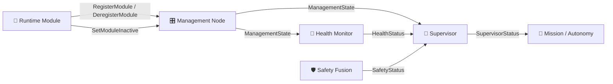
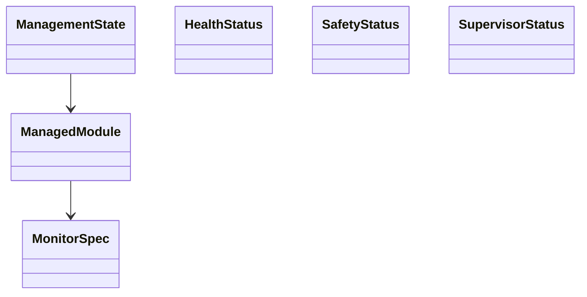
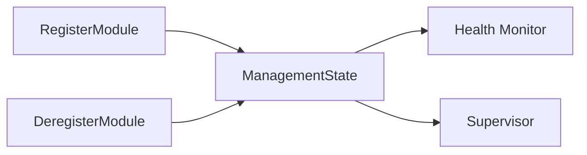
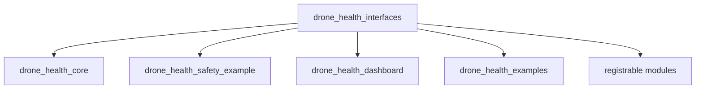

# drone_health_interfaces

A shared ROS 2 interface package containing all custom messages and services used throughout the Drone Health Monitoring Framework. It provides a common communication layer between the Management, Health Monitor, Supervisor, Safety Fusion, Dashboard, and any runtime-registrable modules.

---

## 🏗️ Architecture



**Flow:** Every package communicates using the interfaces defined here. No package depends on another package's implementation—only on these shared message and service definitions.

---

## 📨 Messages

| Message | Purpose |
|---------|---------|
| `HealthStatus.msg` | Reports the health of an individual monitored topic. |
| `SafetyStatus.msg` | Reports the safety decision from the Safety Fusion node. |
| `SupervisorStatus.msg` | Publishes the final system mode and command permission. |
| `ManagementState.msg` | Publishes mission state, module registry, and planned inactive information. |
| `ManagedModule.msg` | Describes a registered module and its monitoring configuration. |
| `MonitorSpec.msg` | Describes a monitored topic including QoS requirements. |



---

## 🔧 Services

| Service | Purpose |
|---------|---------|
| `RegisterModule.srv` | Register a module while the system is running. |
| `DeregisterModule.srv` | Gracefully remove a module from the runtime registry. |
| `SetModuleInactive.srv` | Mark a module as intentionally inactive. |

These services allow modules to join or leave the framework without restarting the system.

---

## 📊 Runtime Registry

`ManagementState.msg` acts as the runtime registry for the entire framework.

It contains:

- Current mission state
- Maintenance mode
- Registered modules
- Topic monitoring configuration
- Planned inactive modules
- Planned inactive topics
- Reasons for inactive modules/topics
- Rejected module registrations

The runtime registry allows the Health Monitor and Supervisor to automatically adapt as modules are added or removed.



---

## 🌟 Why This Package Exists

| Feature | Benefit |
|---------|---------|
| Shared interfaces | Every package communicates using identical message definitions. |
| Decoupled architecture | Nodes depend only on interfaces, not implementations. |
| Runtime extensibility | New modules can register without recompiling other packages. |
| Strong typing | Compile-time validation of all framework communications. |
| Reusable | Can be reused by future robots or projects without modification. |

---

## 📦 Package Contents

```
drone_health_interfaces/
├── msg/
│   ├── HealthStatus.msg
│   ├── SafetyStatus.msg
│   ├── SupervisorStatus.msg
│   ├── ManagementState.msg
│   ├── ManagedModule.msg
│   └── MonitorSpec.msg
├── srv/
│   ├── RegisterModule.srv
│   ├── DeregisterModule.srv
│   └── SetModuleInactive.srv
├── CMakeLists.txt
├── package.xml
└── README.md
```

---

## 🚀 Build

```bash
colcon build --packages-select drone_health_interfaces
source install/setup.bash
```

---

## 📦 Used By



The package is intended to be the single source of truth for all custom ROS 2 interfaces used throughout the framework.

---

## 📄 License

MIT License. Free to use for academic and commercial projects.
