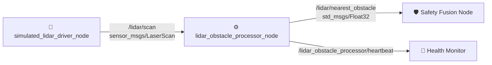
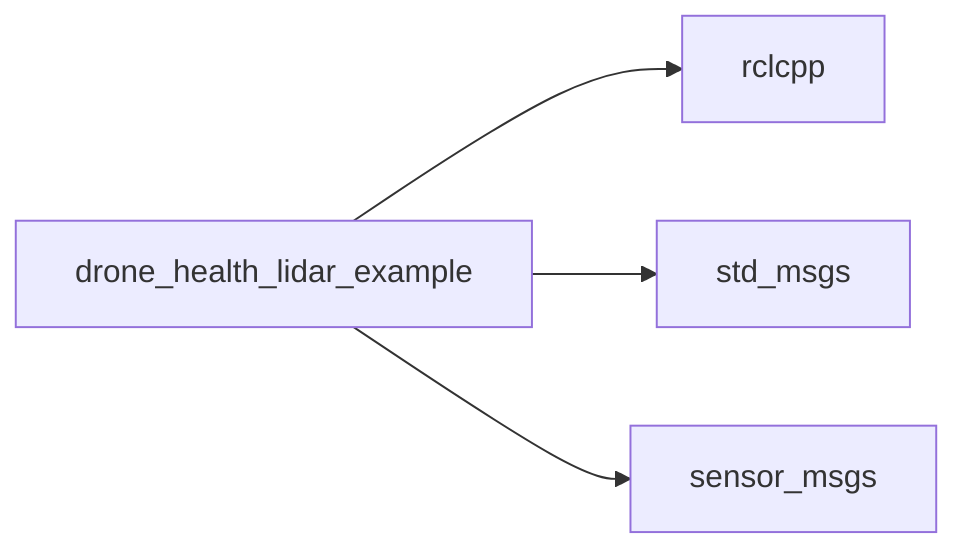

# drone_health_lidar_example

[](https://docs.ros.org/)
[](https://en.cppreference.com/w/cpp/17)

LiDAR example package for the Drone Health Monitoring Framework, demonstrating a complete pipeline from simulated scan data to obstacle distance for safety calculations.

---

## 🏗️ Architecture



---

## 📦 Nodes

| Node | Input | Output | Description |
|---|---|---|---|
| `simulated_lidar_driver_node` | — | `/lidar/scan` | Publishes synthetic `LaserScan` data for testing. |
| `lidar_obstacle_processor_node` | `/lidar/scan` | `/lidar/nearest_obstacle` | Filters ranges, finds nearest valid distance. |

---

## 🚀 Quick Start

```bash
colcon build --packages-select drone_health_lidar_example
source install/setup.bash

# Run in separate terminals
ros2 run drone_health_lidar_example simulated_lidar_driver_node
ros2 run drone_health_lidar_example lidar_obstacle_processor_node

# Monitor output
ros2 topic echo /lidar/nearest_obstacle
```

---

## 🔄 Data Flow

```text
simulated_lidar_driver_node
  → /lidar/scan (LaserScan, best-effort)
  → lidar_obstacle_processor_node
    → clamp range by max_valid_range_m
    → filter NaN/Inf/out-of-bounds
    → find min valid distance
  → /lidar/nearest_obstacle (Float32, reliable + deadline)
  → safety_fusion_node
```

---

## 🛠️ Real Hardware Replacement

Replace `simulated_lidar_driver_node` with any real LiDAR driver publishing `sensor_msgs/LaserScan` on `/lidar/scan`. The obstacle processor needs **no changes** — it is hardware-agnostic.

---

## ⚠️ Failure Behavior

| Scenario | Effect |
|---|---|
| Driver stops publishing | Processor stops → Safety Fusion detects stale data → `UNSAFE` |
| Processor crashes | Heartbeat stops → Health Monitor flags `STALE`/`ERROR` |
| All scan ranges invalid | Processor publishes `effective_max_range` as fallback |

---

## 📦 Dependencies



---

## 📄 License
MIT License. Free to use for academic and commercial projects.
