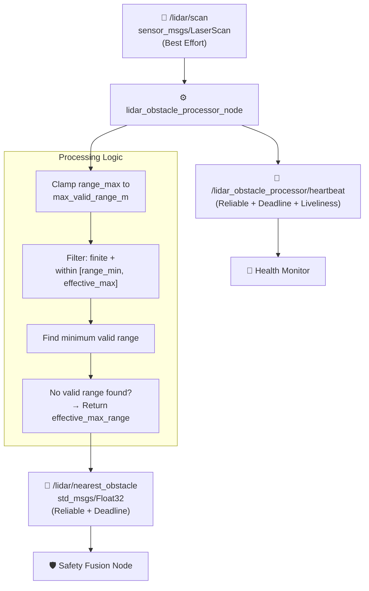
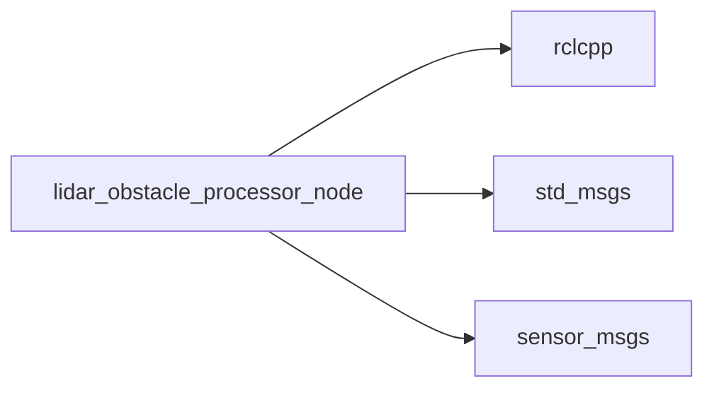

# drone_health_lidar_example

[](https://docs.ros.org/)
[](https://en.cppreference.com/w/cpp/17)

A reference LiDAR obstacle processing node that consumes raw `sensor_msgs/LaserScan` data and publishes the nearest valid obstacle distance. This node feeds directly into the **Safety Fusion Node** to enable kinematic braking clearance calculations.

---

## 🏗️ Architecture



**Flow**: Each incoming `LaserScan` is processed synchronously in the subscription callback. The effective max range is clamped to `min(scan.range_max, max_valid_range_m)`. Every reading is checked for `isfinite()` and bounds `[range_min, effective_max_range]`; the smallest valid reading is published. If **no** valid reading exists, the node publishes the `effective_max_range` as a safe fallback (never `inf` or `NaN`).

---

## 🚀 Quick Start

### 1. Build
```bash
colcon build --packages-select drone_health_lidar_example
source install/setup.bash
```

### 2. Run
```bash
ros2 run drone_health_lidar_example lidar_obstacle_processor_node
```

### 3. Monitor Output
```bash
ros2 topic echo /lidar/nearest_obstacle
ros2 topic echo /lidar_obstacle_processor/heartbeat
```

---

## 📡 Interfaces

| Direction | Topic | Type | QoS |
|---|---|---|---|
| **Sub** | `/lidar/scan` | `sensor_msgs/LaserScan` | Best Effort, `KeepLast(5)` |
| **Pub** | `/lidar/nearest_obstacle` | `std_msgs/Float32` | Reliable, `KeepLast(10)`, Deadline (`obstacle_deadline_ms`) |
| **Pub** | `/lidar_obstacle_processor/heartbeat` | `std_msgs/String` | Reliable, Deadline + Manual Liveliness |

---

## ⚙️ Parameters

| Parameter | Type | Default | Description |
|---|---|---|---|
| `max_valid_range_m` | `double` | `12.0` | Caps `scan.range_max` — readings beyond this are treated as invalid. |
| `obstacle_deadline_ms` | `int` | `250` | DDS deadline QoS for the `/lidar/nearest_obstacle` publisher. |
| `heartbeat_period_ms` | `int` | `500` | Heartbeat publish interval. |
| `heartbeat_deadline_ms` | `int` | `700` | DDS deadline QoS for heartbeat (must be `>` `heartbeat_period_ms`). |
| `heartbeat_liveliness_ms` | `int` | `1500` | DDS manual liveliness lease (must be `>` `heartbeat_deadline_ms`). |

> ⚠️ The node throws a startup error if `heartbeat_period_ms < heartbeat_deadline_ms < heartbeat_liveliness_ms` is violated, or if `max_valid_range_m` / `obstacle_deadline_ms` are not positive.

---

## 🔄 Nearest Range Algorithm

```cpp
effective_max_range = min(scan.range_max, max_valid_range_m)

for each range in scan.ranges:
    valid = isfinite(range) AND range >= scan.range_min AND range <= effective_max_range
    if valid and range < nearest:
        nearest = range

if no valid range found:
    publish(effective_max_range)   // safe fallback, not inf/NaN
else:
    publish(nearest)
```

| Condition | Published Value |
|---|---|
| Valid obstacle within range | Minimum valid distance (meters) |
| No obstacles / all readings out of range | `effective_max_range` (treated as "clear") |
| Scan readings are `NaN`/`Inf` | Automatically excluded from consideration |

---

## ⚠️ Failure & Safety Behavior

| Scenario | Processor Behavior | Downstream Impact |
|---|---|---|
| `/lidar/scan` stops publishing | No new `nearest_obstacle` message sent | Safety Fusion's `obstacle_timeout_ms` expires → forces `UNSAFE` |
| All scan ranges invalid/out-of-range | Publishes `effective_max_range` (fallback, not an error) | Treated as "no obstacle detected" by Safety Fusion |
| Deadline missed on `/lidar/nearest_obstacle` | DDS `deadline_missed` event fires | Health Monitor flags `ERROR` even if last value is cached |
| Processor node crashes | Heartbeat liveliness lease expires | Health Monitor flags `STALE`/`ERROR`; Supervisor may trigger `FAILSAFE` |

---

## 🌟 Integration Benefits

| Feature | Benefit |
|---|---|
| **Range clamping** | Prevents unrealistic long-range LiDAR noise from masking real obstacles. |
| **Synchronous processing** | Each scan is processed and published immediately — no buffering lag. |
| **Safe fallback value** | Never publishes `NaN`/`Inf`; downstream consumers always get a usable float. |
| **DDS deadline enforcement** | Missing scans trigger immediate QoS deadline events, not just timeouts. |

---

## 🛠️ Build & Debug

```bash
# Build
colcon build --packages-select drone_health_lidar_example
source install/setup.bash

# Run
ros2 run drone_health_lidar_example lidar_obstacle_processor_node

# Debug
ros2 topic echo /lidar/nearest_obstacle
ros2 topic echo /lidar_obstacle_processor/heartbeat
ros2 topic hz /lidar/scan
```

---

## 📦 Dependencies



---

## 📄 License
MIT License. Free to use for academic and commercial robotics projects.
