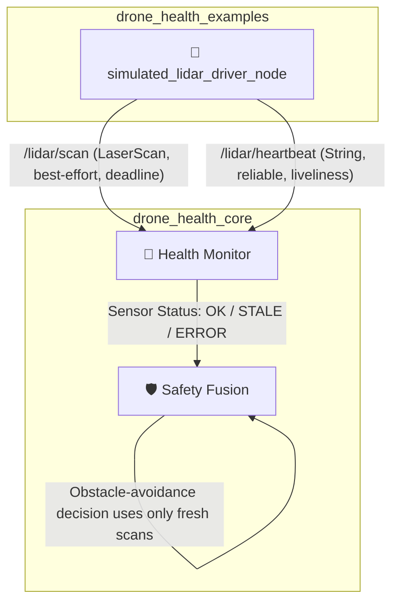

# simulated_lidar_driver_node

[](https://docs.ros.org/)
[](https://en.cppreference.com/w/cpp/17)

A demonstration node that simulates a 2D LiDAR scanner for the **Drone Health Monitoring Framework**. It publishes synthetic `LaserScan` data with moving obstacle patterns and a heartbeat signal, using QoS deadlines and liveliness leases that mirror a real LiDAR driver — enabling `HealthMonitor` and `SafetyFusion` to be validated against obstacle-detection and sensor-failure scenarios without physical hardware.

---

## 🏗️ Role in the Health Monitoring Architecture



The node exists purely to **feed realistic, configurable LiDAR telemetry** into the health-monitoring pipeline so that deadline-miss handling, liveliness loss, and stale-scan rejection can be validated end-to-end.

---

## 🎯 Purpose

Publishes a simulated 2D laser scan and heartbeat topic, with QoS settings (deadlines + liveliness lease) that mirror what a real LiDAR driver would provide. Synthetic obstacles are placed in front, left, and right sectors of the scan and oscillate over time, allowing downstream nodes to be tested for:

- Deadline-miss detection on `/lidar/scan`
- Liveliness loss detection on `/lidar/heartbeat`
- Correct rejection of stale scan data in obstacle-avoidance / safety logic

---

## 📥 Inputs

None. This is a self-contained data source for simulation/testing.

## 📤 Outputs

| Topic | Type | QoS |
| :--- | :--- | :--- |
| `/lidar/scan` | `sensor_msgs/msg/LaserScan` | Best-effort, `KeepLast(5)`, deadline = `scan_deadline_ms` |
| `/lidar/heartbeat` | `std_msgs/msg/String` | Reliable, `KeepLast(10)`, deadline = `heartbeat_deadline_ms`, manual-by-topic liveliness, lease = `heartbeat_liveliness_ms` |

---

## ⚙️ Parameters

| Parameter | Type | Default | Description |
| :--- | :--- | :--- | :--- |
| `frame_id` | string | `lidar_link` | Frame ID stamped on `LaserScan` messages |
| `publish_period_ms` | int | `100` | Timer period for publishing scan + heartbeat |
| `scan_deadline_ms` | int | `200` | QoS deadline for `/lidar/scan` |
| `heartbeat_deadline_ms` | int | `300` | QoS deadline for `/lidar/heartbeat` |
| `heartbeat_liveliness_ms` | int | `1000` | Liveliness lease duration for `/lidar/heartbeat` |
| `range_min_m` | double | `0.12` | Minimum reportable range (must be > 0) |
| `range_max_m` | double | `12.0` | Maximum reportable range (must be > `range_min_m`) |
| `angle_min_rad` | double | `-1.5708` (-90°) | Start angle of the scan |
| `angle_max_rad` | double | `1.5708` (+90°) | End angle of the scan (must be > `angle_min_rad`) |
| `beam_count` | int | `181` | Number of beams across the scan (must be ≥ 2) |

> ⚠️ Constructor validation will throw at startup if:
> - `publish_period_ms <= 0`
> - `beam_count < 2`
> - `range_min_m <= 0.0` or `range_max_m <= range_min_m`
> - `angle_max_rad <= angle_min_rad`

---

## 🚀 Run Command

```bash
ros2 run drone_health_lidar_example simulated_lidar_driver_node
```

**Custom field-of-view / resolution example:**
```bash
ros2 run drone_health_lidar_example simulated_lidar_driver_node --ros-args \
  -p beam_count:=360 \
  -p angle_min_rad:=-3.14159 \
  -p angle_max_rad:=3.14159 \
  -p range_max_m:=20.0
```

**Tight QoS example (for deadline/liveliness failure testing):**
```bash
ros2 run drone_health_lidar_example simulated_lidar_driver_node --ros-args \
  -p publish_period_ms:=50 \
  -p scan_deadline_ms:=120 \
  -p heartbeat_deadline_ms:=200 \
  -p heartbeat_liveliness_ms:=600
```

---

## 🎭 Expected Behavior

Each scan cycle generates `beam_count` ranges spanning `[angle_min_rad, angle_max_rad]`, defaulting to `range_max_m` everywhere except three simulated obstacle sectors:

| Sector | Angle Range (rad) | Distance Pattern |
| :--- | :--- | :--- |
| **Front** | `|angle| < 0.25` | `2.5 + 0.7 * sin(t)` m |
| **Right** | `0.55 < angle < 0.85` | `4.0 + 0.5 * sin(t * 0.6)` m |
| **Left** | `-1.05 < angle < -0.75` | `5.0 + 0.4 * cos(t * 0.4)` m |

All distances are clamped to `[range_min_m, range_max_m]`. Intensities are fixed at `100.0`. The obstacles oscillate smoothly over time, simulating a slowly approaching/receding object directly ahead and stationary-ish objects to the sides — useful for exercising obstacle-avoidance thresholds and filtering logic in `SafetyFusion`.

`/lidar/heartbeat` is published every cycle and `assert_liveliness()` is called immediately after, so a healthy run should never trigger a liveliness lease expiration on the `HealthMonitor` side.

---

## 🛑 Failure Behavior

This node is also used to validate **degraded and failure paths** in the framework:

- **Node stopped / killed:** No more `/lidar/scan` or `/lidar/heartbeat` messages are published. `HealthMonitor` should detect the deadline miss on `/lidar/scan` and the liveliness lease expiration on `/lidar/heartbeat`, and report a **LiDAR sensor failure**.
- **Topic goes stale (process still alive but blocked/slow):** If publishing falls behind `scan_deadline_ms`, the deadline QoS event fires on the subscriber side even though the node process is technically running.
- **Downstream protection:** `SafetyFusion` must **not** use stale `/lidar/scan` data for obstacle-avoidance or proximity decisions once `HealthMonitor` reports the sensor as `STALE` or `ERROR` — it should fall back to a safe/conservative behavior (e.g., halt or reduced speed) instead.

You can simulate a failure manually by killing the node mid-run, or by setting an artificially tight `scan_deadline_ms` relative to `publish_period_ms` to force intermittent deadline misses for testing.

---

## 📄 License
MIT License. Free to use for academic and commercial robotics projects.
