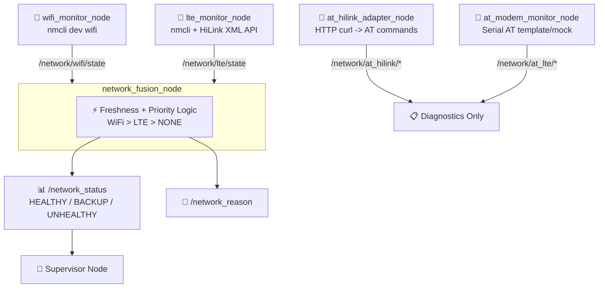
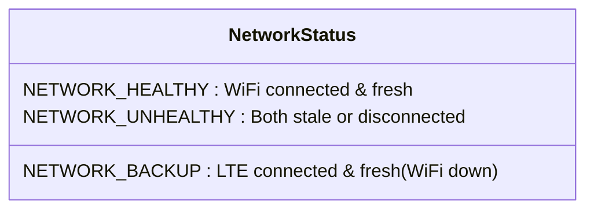
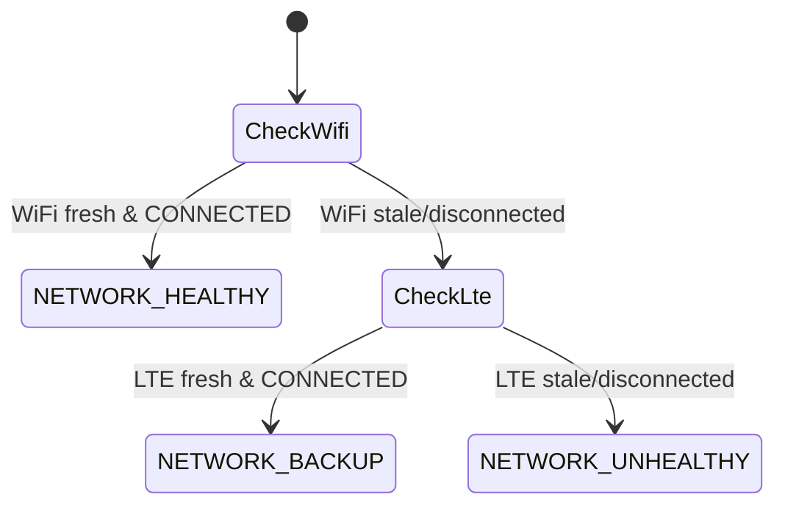
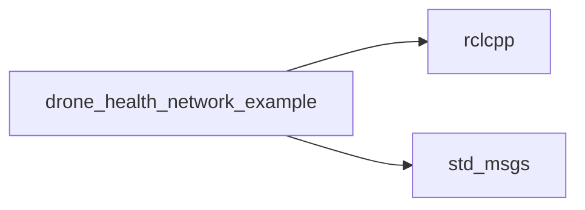

# drone_health_network_example

[](https://docs.ros.org/)

A multi-source network health monitoring package that tracks WiFi, LTE (NetworkManager + AT-over-HTTP HiLink), and serial AT modem links, fusing them into a single redundant connectivity status for the Supervisor Node in the drone health framework.

---

## 🏗️ Architecture



**Flow**: `wifi_monitor_node` and `lte_monitor_node` independently report link state. `network_fusion_node` checks freshness (10s timeout) and prefers WiFi over LTE, publishing a single `/network_status` consumed by the Supervisor. The AT adapter nodes provide deep diagnostic telemetry (signal, operator, RAT) but do not feed directly into the fusion decision.

---

## 🚀 Quick Start

```bash
# Build
colcon build --packages-select drone_health_network_example
source install/setup.bash

# Run each node in separate terminals
ros2 run drone_health_network_example wifi_monitor_node
ros2 run drone_health_network_example lte_monitor_node
ros2 run drone_health_network_example network_fusion_node
ros2 run drone_health_network_example at_hilink_adapter_node
ros2 run drone_health_network_example at_modem_monitor_node --ros-args -p mock_mode:=true
```

---

## 📡 Nodes & Topics

| Node | Publishes | Source |
|---|---|---|
| `wifi_monitor_node` | `/network/wifi/state`, `connected_ssid`, `link_speed_mbps`, `signal_bars`, `available_ssids` | `nmcli dev wifi` |
| `lte_monitor_node` | `/network/lte/state`, `operator`, `rat`, `rssi_dbm`, `rsrp_dbm`, `rsrq_db`, `sinr_db`, `plmn` | `nmcli` interface + HiLink HTTP XML |
| `at_hilink_adapter_node` | `/network/at_hilink/*` (state, operator, rat, rssi, rsrp, rsrq, sinr, plmn, at_summary) | HiLink router HTTP API (curl) |
| `at_modem_monitor_node` | `/network/at_lte/*` (state, operator, rat, rssi, rsrp, rsrq, sinr, plmn) | Serial AT commands (mock or template) |
| `network_fusion_node` | `/network_status`, `/network_reason` | Fuses WiFi + LTE freshness/state |

All nodes publish a `heartbeat` on their own namespace (e.g. `/network/wifi/heartbeat`) with manual liveliness QoS.



---

## 🌟 Why It's Reusable

| Feature | Benefit |
|---|---|
| **Source-agnostic fusion** | `network_fusion_node` only needs `state` strings — swap in any link type |
| **HTTP & Serial AT support** | HiLink adapter works out-of-box; serial template ready for real modem hardware |
| **Mock mode** | `at_modem_monitor_node` runs without hardware for development/testing |
| **Freshness-based failover** | Stale data (>10s) is treated as disconnected, preventing false "healthy" status |
| **Heartbeat per source** | Health Monitor can detect if a specific link monitor process crashes |

---

## 🔄 Fusion Decision Logic



| Condition | `/network_status` | `active` |
|---|---|---|
| WiFi fresh + CONNECTED | `NETWORK_HEALTHY` | `WIFI` |
| WiFi down, LTE fresh + CONNECTED | `NETWORK_BACKUP` | `LTE` |
| Both stale or disconnected | `NETWORK_UNHEALTHY` | `NONE` |

---

## ⚙️ Configuration Notes

- **`lte_monitor_node`**: hardcoded `lte_interface_` (e.g. `enx001e101f0000`) — update to match your USB/LTE dongle interface name.
- **`at_hilink_adapter_node`**: targets HiLink router default gateway `192.168.8.1` via `curl`; no params needed.
- **`at_modem_monitor_node`** parameters:

```yaml
at_modem_monitor_node:
  ros__parameters:
    mock_mode: true
    serial_port: /dev/ttyUSB0
    baud_rate: 115200
    poll_period_ms: 2000
    command_delay_ms: 2000
    response_timeout_ms: 1000
```

> ⚠️ `send_at_command()` in `at_modem_monitor_node` is a **template stub**. Real serial AT support (open port, write `AT\r`, parse `OK`/`ERROR`) is future implementation work.

---

## 🛠️ Build & Debug

```bash
colcon build --packages-select drone_health_network_example
source install/setup.bash

ros2 topic echo /network_status
ros2 topic echo /network_reason
ros2 topic echo /network/at_hilink/at_summary
```

---

## 📦 Dependencies



System tools required at runtime: `nmcli` (NetworkManager), `curl` (HiLink HTTP API).

---

## 📄 License
MIT License. Free to use for academic and commercial projects.
