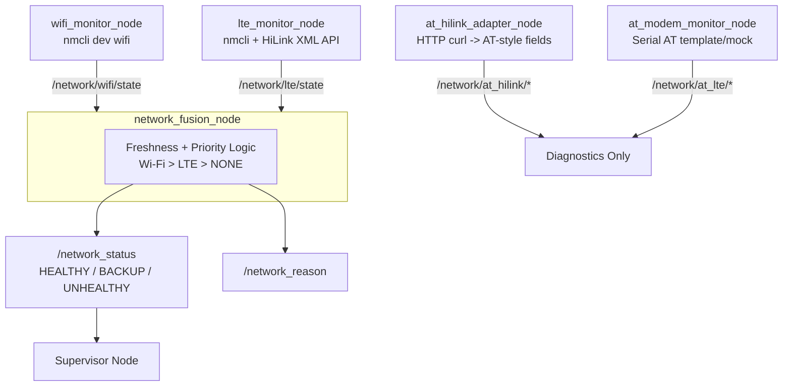
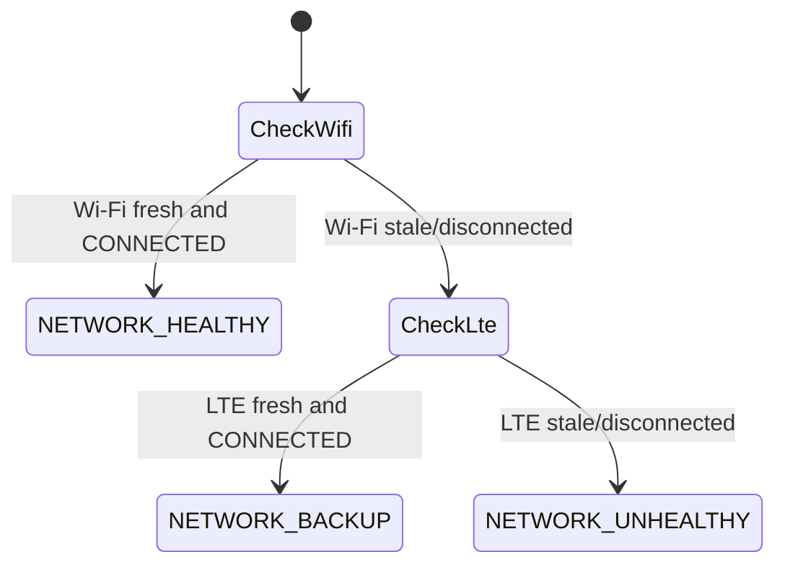
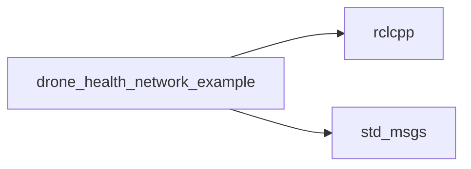

# drone_health_network_example

[](https://docs.ros.org/)

A multi-source network health monitoring package that tracks Wi-Fi, LTE through NetworkManager and Huawei HiLink HTTP, and a serial AT modem template/mock. The nodes fuse Wi-Fi and LTE into one redundant connectivity status for the Supervisor Node in the drone health framework.

---

## Architecture



Flow: `wifi_monitor_node` and `lte_monitor_node` independently report link state. `network_fusion_node` checks freshness with a 10 second timeout and prefers Wi-Fi over LTE, publishing one `/network_status` consumed by the Supervisor. The AT adapter nodes provide diagnostic telemetry such as signal, operator, and RAT, but do not feed directly into the fusion decision.

---

## Quick Start

```bash
colcon build --packages-select drone_health_network_example
source install/setup.bash

ros2 run drone_health_network_example wifi_monitor_node
ros2 run drone_health_network_example lte_monitor_node
ros2 run drone_health_network_example network_fusion_node
ros2 run drone_health_network_example at_hilink_adapter_node
ros2 run drone_health_network_example at_modem_monitor_node --ros-args -p mock_mode:=true -p mock_response_mode:=ok
```

Tune mock AT timing parameters:

```bash
ros2 run drone_health_network_example at_modem_monitor_node --ros-args \
  -p mock_mode:=true \
  -p mock_response_mode:=ok \
  -p poll_period_ms:=2000 \
  -p command_delay_ms:=2000 \
  -p response_timeout_ms:=1000
```

Show fake AT error/timeout cases:

```bash
ros2 run drone_health_network_example at_modem_monitor_node --ros-args \
  -p mock_mode:=true \
  -p mock_response_mode:=error
```

```bash
ros2 run drone_health_network_example at_modem_monitor_node --ros-args \
  -p mock_mode:=true \
  -p mock_response_mode:=timeout
```

Supported mock response modes:

```text
ok
error
timeout
no_sim
no_service
modem_busy
serial_disconnect
```

---

## Nodes And Topics

| Node | Publishes | Source |
|---|---|---|
| `wifi_monitor_node` | `/network/wifi/state`, `/network/wifi/connected_ssid`, `/network/wifi/link_speed_mbps`, `/network/wifi/signal_bars`, `/network/wifi/available_ssids` | `nmcli dev wifi` |
| `lte_monitor_node` | `/network/lte/state`, `/network/lte/operator`, `/network/lte/rat`, `/network/lte/rssi_dbm`, `/network/lte/rsrp_dbm`, `/network/lte/rsrq_db`, `/network/lte/sinr_db`, `/network/lte/plmn` | `nmcli` interface + HiLink HTTP XML |
| `at_hilink_adapter_node` | `/network/at_hilink/*`, including `/network/at_hilink/at_summary` | Huawei HiLink HTTP API through `curl` |
| `at_modem_monitor_node` | `/network/at_lte/*`, including state, operator, RAT, RSSI, RSRP, RSRQ, SINR, PLMN | Serial AT template or mock |
| `network_fusion_node` | `/network_status`, `/network_reason`, `/network/heartbeat` | Fuses Wi-Fi + LTE freshness/state |

All nodes publish a heartbeat on their own namespace, for example `/network/wifi/heartbeat`, with manual liveliness QoS.

---

## Dashboard Meaning

The dashboard intentionally separates Huawei LTE data from serial AT modem data:

```text
LTE / Huawei tab:
  Source is the Huawei HiLink HTTP API at http://192.168.8.1.
  Values are displayed with AT-style labels such as AT+COPS?, AT+CSQ, and AT^HCSQ.
  These are real Huawei stick values, but they are not read through a serial AT port.

Serial AT tab:
  Source is at_modem_monitor_node.
  The top row shows the overall AT response, for example AT=OK, AT=ERROR, or AT=TIMEOUT.
  The rows below show AT-style command values such as AT+COPS?, AT^SYSINFOEX, AT+CSQ, and AT^HCSQ.
  With mock_mode:=true, values are fake hardcoded AT-style values for dashboard and health testing.
  Future students can replace the template backend with real /dev/ttyUSB0 serial AT communication.
```

---

## Mock AT Values

With `mock_mode:=true` and `mock_response_mode:=ok`, `at_modem_monitor_node` publishes fake values:

```text
State: CONNECTED_MOCK
Operator: MOCK_OPERATOR
RAT: LTE/4G
RSSI: -65 dBm
RSRP: -96 dBm
RSRQ: -12 dB
SINR: 2 dB
PLMN: 26202
```

These appear in the dashboard Serial AT tab as rows:

```text
AT              AT=OK
Source          Mock Serial AT
State           CONNECTED_MOCK
AT+COPS?        MOCK_OPERATOR
AT^SYSINFOEX    LTE/4G
AT+CSQ          -65 dBm
AT^HCSQ RSRP    -96 dBm
AT^HCSQ RSRQ    -12 dB
AT^HCSQ SINR    2 dB
```

Failure modes appear as simulated AT responses. For example, `mock_response_mode:=timeout` produces:

```text
AT              AT=TIMEOUT
State           TIMEOUT_MOCK
AT+COPS?        TIMEOUT
AT^SYSINFOEX    TIMEOUT
AT+CSQ          TIMEOUT
AT^HCSQ RSRP    TIMEOUT
AT^HCSQ RSRQ    TIMEOUT
AT^HCSQ SINR    TIMEOUT
```

---

## AT Timing Parameters

The professor's suggestion to "play with the numbers" means testing different modem timing values:

```text
poll_period_ms       how often the node polls the modem
command_delay_ms     delay between AT commands; start around 2000 ms
response_timeout_ms  time to wait for OK, ERROR, or timeout
```

In mock mode these parameters document and simulate the intended behavior. `mock_response_mode` lets the dashboard show expected success, error, timeout, no-SIM, no-service, modem-busy, and serial-disconnect states. Real stability testing requires serial LTE/5G hardware.

---

## Fusion Decision Logic



| Condition | `/network_status` | Active connection |
|---|---|---|
| Wi-Fi fresh + `CONNECTED` | `NETWORK_HEALTHY` | `WIFI` |
| Wi-Fi down, LTE fresh + `CONNECTED` | `NETWORK_BACKUP` | `LTE` |
| Both stale or disconnected | `NETWORK_UNHEALTHY` | `NONE` |

---

## Why It Is Reusable

| Feature | Benefit |
|---|---|
| Source-agnostic fusion | `network_fusion_node` only needs state strings, so another link type can replace Wi-Fi or LTE |
| HTTP and serial AT paths | HiLink adapter works with the current Huawei stick; serial template is ready for future modem hardware |
| Mock mode | `at_modem_monitor_node` runs without hardware for development, dashboard testing, and failure-mode demos |
| Freshness-based failover | Stale data after 10 seconds is treated as disconnected, reducing false healthy states |
| Heartbeat per source | Health Monitor can detect if a specific link monitor process crashes |

---

## Configuration Notes

- `lte_monitor_node`: hardcoded `lte_interface_`, for example `enx001e101f0000`; update this to match the USB/LTE dongle interface name.
- `at_hilink_adapter_node`: targets the HiLink router default gateway `192.168.8.1` through `curl`; no parameters are currently required.
- `at_modem_monitor_node` parameters:

```yaml
at_modem_monitor_node:
  ros__parameters:
    mock_mode: true
    mock_response_mode: ok
    serial_port: /dev/ttyUSB0
    baud_rate: 115200
    poll_period_ms: 2000
    command_delay_ms: 2000
    response_timeout_ms: 1000
```

`send_at_command()` in `at_modem_monitor_node` is a template stub. The remaining hardware-dependent work is to open a serial port such as `/dev/ttyUSB0`, write AT commands, wait between commands, read until `OK`, `ERROR`, or timeout, handle retries/errors, and return the raw modem response for parsing.

---

## Build And Debug

```bash
colcon build --packages-select drone_health_network_example
source install/setup.bash

ros2 topic echo /network_status
ros2 topic echo /network_reason
ros2 topic echo /network/at_hilink/at_summary
ros2 topic echo /network/at_lte/state
```

---

## Dependencies



System tools required at runtime: `nmcli` for NetworkManager and `curl` for the HiLink HTTP API.

---

## License

MIT License. Free to use for academic and commercial projects.
