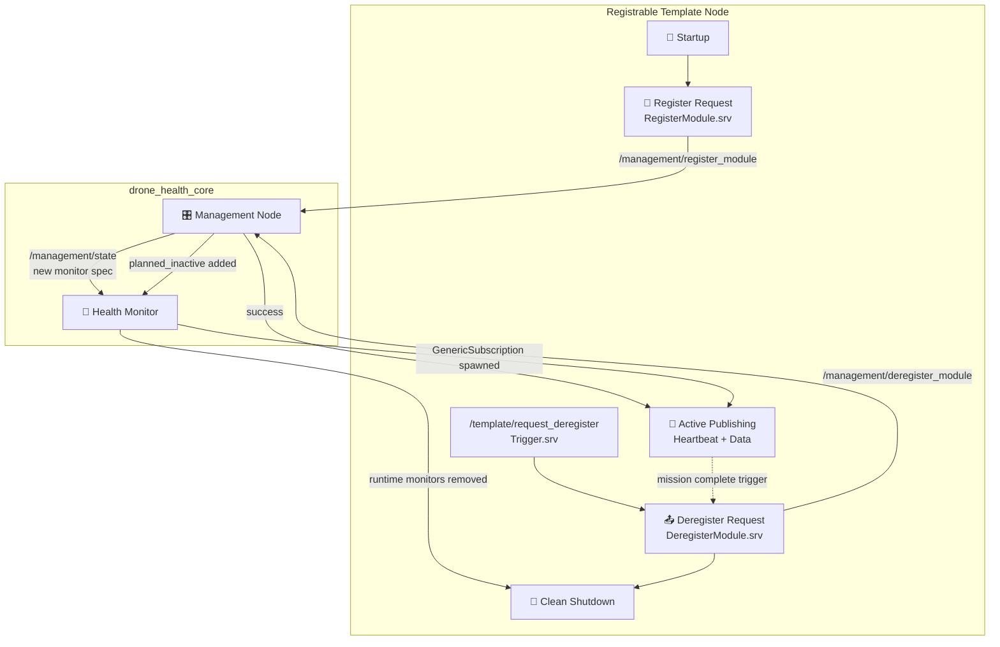

# drone_health_registrable_template

[](https://docs.ros.org/)
[](https://en.cppreference.com/w/cpp/17)

A reusable boilerplate node demonstrating the **correct lifecycle pattern** for any module that needs to dynamically join and leave the Drone Health Monitoring Framework at runtime. Use this as a starting point when building new sensors, payloads, or removable components that must self-register their heartbeat and QoS requirements without editing core YAML files.

---

## 🏗️ Lifecycle Architecture



**Flow**: On startup, the node calls `register_module` with its heartbeat and (optional) data topic specs. Once approved, it publishes continuously. When `request_deregister` is called — or a custom trigger condition is met — it calls `deregister_module` first, and only shuts down **after** the Management Node confirms the request, ensuring the Health Monitor never sees a false failure.

---

## 🎯 Purpose

This package teaches the correct pattern for:

- ✅ Heartbeat publishing with proper DDS QoS (deadline + liveliness)
- ✅ Runtime registration via `RegisterModule.srv`
- ✅ Planned deregistration via `DeregisterModule.srv`
- ✅ Graceful, approved shutdown (not just `Ctrl+C`)
- ✅ Demonstrating the difference between a **crash** (STALE/ERROR) and a **planned exit** (planned inactive, no false failure)

---

## 📦 Package Structure

```
drone_health_registrable_template/
└── template_node/
    ├── registrable_template_node.cpp
    └── README.md
```

---

## 🔄 Responsibility Split

This is an **example/template only** — it contains no core monitoring logic.

| Component | Responsibility |
|---|---|
| **Registrable Node** *(this package)* | Calls register/deregister services; publishes its own heartbeat/data. |
| **Management Node** | Approves/rejects registration; tracks runtime registry & planned inactive state. |
| **Health Monitor** | Subscribes dynamically to registered heartbeat/data topics; reports `OK` / `STALE` / `ERROR` while active and removes runtime monitors when planned inactive. |
| **Dashboard** | Visualizes the resulting module status. |

---

## 🚀 Quick Start

### 1. Build
```bash
colcon build --packages-select drone_health_registrable_template
source install/setup.bash
```

### 2. Start Core Nodes First
```bash
ros2 run drone_health_core management_node --ros-args --params-file /home/nila/Desktop/drone_health_modular_ws/src/drone_health_core/management/management.yaml
ros2 run drone_health_core health_monitor_node --ros-args --params-file /home/nila/Desktop/drone_health_modular_ws/src/drone_health_core/health_monitor/health_monitor.yaml
```

### 3. Run the Template Node
```bash
ros2 run drone_health_registrable_template registrable_template_node
```

### 4. Trigger Planned Deregistration
```bash
ros2 service call /template/request_deregister std_srvs/srv/Trigger "{}"
```

---

## ⚙️ Parameters

| Parameter | Type | Default | Description |
|---|---|---|---|
| `module_name` | `string` | `"template_node"` | Unique identifier registered with the Management Node. |
| `critical` | `bool` | `false` | Whether mission start/maintenance should be blocked if this module fails. |
| `heartbeat_topic` | `string` | `/template/heartbeat` | Topic used to prove liveness. |
| `publish_period_ms` | `int` | `200` | Heartbeat/data publish interval. Must be `<` `heartbeat_deadline_ms`. |
| `heartbeat_deadline_ms` | `int` | `500` | DDS deadline QoS for the heartbeat (0 disables, but liveliness must then be set). |
| `heartbeat_liveliness_ms` | `int` | `0` | DDS manual liveliness lease (must be `>` deadline if both set). |
| `publish_data_topic` | `bool` | `true` | Whether to also register and publish an example data topic. |
| `data_topic` | `string` | `/template/value` | Example `Float32` data topic, must start with `/`. |
| `data_deadline_ms` | `int` | `500` | DDS deadline QoS for the data topic. |

> ⚠️ At least one of `heartbeat_deadline_ms` or `heartbeat_liveliness_ms` must be non-zero — the node throws a startup error otherwise.

---

## 📡 Interfaces

| | Name | Type | Role |
|---|---|---|---|
| **Pub** | `<heartbeat_topic>` | `std_msgs/String` | Heartbeat with deadline/liveliness QoS. |
| **Pub** | `<data_topic>` | `std_msgs/Float32` | Optional example data stream (incrementing counter). |
| **Client** | `/management/register_module` | `RegisterModule` | Sends `MonitorSpec` for heartbeat (+data) on startup. |
| **Client** | `/management/deregister_module` | `DeregisterModule` | Requests planned inactive status before shutdown. |
| **Srv** | `/template/request_deregister` | `std_srvs/Trigger` | External trigger to start the deregistration sequence. |

---

## 📊 Expected vs Failure Behavior

| Scenario | Management Node State | Health Monitor Verdict |
|---|---|---|
| **Normal startup** | Module appears in `managed_modules` | `OK` once first heartbeat/data messages arrive |
| **`request_deregister` called** | Module appears in `planned_inactive_modules` (`reason: deregistered`) | Runtime health tiles are removed; no false failure is shown |
| **Node killed (`Ctrl+C`/crash)** *without deregistering* | No state change — module still "active" | `STALE` (timeout) or `ERROR` (deadline/liveliness lost) |

---

## 🧩 Current Scope & Future Extension

**Currently Supported:**
- ✅ Runtime heartbeat monitoring (auto-spawned `GenericSubscription`)
- ✅ Runtime data-topic monitoring with generic subscriptions

**Future Work:**
- 🔲 Multi-topic deregistration granularity (per-topic vs per-module)

Use this template as a starting point for:
- 📷 Camera / vision modules
- 🛰️ GPS / positioning modules
- 📶 Network adapters
- 🔍 Inspection payloads
- 🔧 Any removable robot component

---

## 📄 License
MIT License. Free to use for academic and commercial robotics projects.
