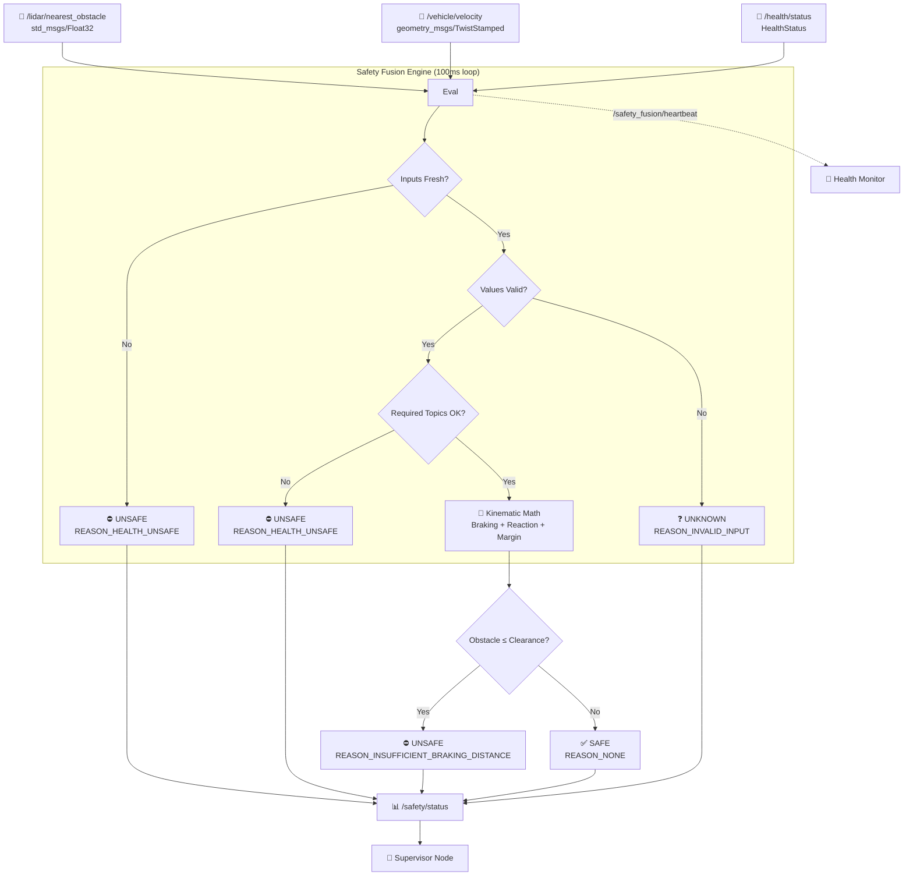
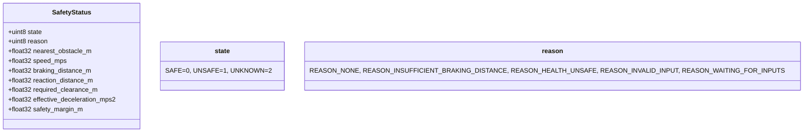
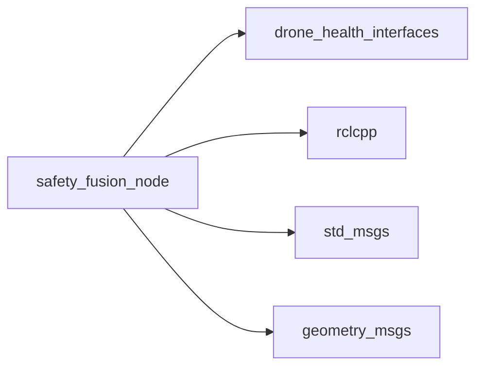

# drone_health_safety_example

[](https://docs.ros.org/)
[](https://en.cppreference.com/w/cpp/17)

A reference safety-critical node that fuses **obstacle distance**, **vehicle velocity**, and **upstream health diagnostics** to compute real-time kinematic braking clearance for the Drone Health Monitoring Framework. This package demonstrates how to build a **Health-Aware Safety Gate** that feeds directly into the Supervisor's Go/No-Go decision.

---

## 🏗️ Architecture



**Flow**: A 100ms timer evaluates fused inputs in strict priority order — waiting for first data → freshness timeouts (per-topic) → value validation → upstream health validation → kinematic braking math → final SAFE/UNSAFE verdict. The Supervisor treats any non-`SAFE` state as a reason to block mission commands.

---

## 🚀 Quick Start

### 1. Build
```bash
colcon build --packages-select drone_health_safety_example
source install/setup.bash
```

### 2. Run
```bash
ros2 run drone_health_safety_example safety_fusion_node \
  --ros-args --params-file \
  src/drone_health_safety_example/safety_fusion/safety_fusion.yaml
```

### 3. Watch the Output
```bash
ros2 topic echo /safety/status
```

---

## ⚙️ Configuration

```yaml
safety_fusion_node:
  ros__parameters:
    # --- Topics ---
    nearest_obstacle_topic: /lidar/nearest_obstacle
    velocity_topic: /vehicle/velocity
    health_status_topic: /health/status
    safety_status_topic: /safety/status
    heartbeat_topic: /safety_fusion/heartbeat

    # --- Required Upstream Health ---
    required_health_topics:
      - /lidar/nearest_obstacle
      - /vehicle/velocity

    # --- Timing & Freshness ---
    evaluation_period_ms: 100
    health_status_timeout_ms: 1500
    obstacle_timeout_ms: 700
    velocity_timeout_ms: 700

    # --- Physics Parameters ---
    max_deceleration_mps2: 1.5
    reaction_time_s: 0.2
    safety_margin_m: 0.5

    # --- Heartbeat QoS ---
    heartbeat_period_ms: 500
    heartbeat_deadline_ms: 700
    heartbeat_liveliness_ms: 1500
```

### Parameter Definitions
| Parameter | Description |
|---|---|
| `nearest_obstacle_topic` | Distance to nearest obstacle in meters (`std_msgs/Float32`). |
| `velocity_topic` | Vehicle velocity, magnitude computed from linear x/y/z (`geometry_msgs/TwistStamped`). |
| `required_health_topics` | Topics that **must** report `OK` health for a `SAFE` verdict. |
| `obstacle_timeout_ms` / `velocity_timeout_ms` | Per-input freshness windows — independent of `evaluation_period_ms`. |
| `health_status_timeout_ms` | Max age of the latest `/health/status` message before treated as unsafe. |
| `max_deceleration_mps2` | Max braking deceleration the vehicle can achieve. |
| `reaction_time_s` | Delay between obstacle detection and brake application. |
| `safety_margin_m` | Extra buffer distance added to required clearance. |

### Timing Rule
```
heartbeat_period_ms < heartbeat_deadline_ms < heartbeat_liveliness_ms
```
The node throws a startup error if this is violated.

---

## 📐 Safety Math

```
Required Clearance = Braking Distance + Reaction Distance + Safety Margin

Braking Distance  = speed² / (2 × max_deceleration_mps2)
Reaction Distance = speed × reaction_time_s
```

---

## 📊 Decision Logic (Evaluated in Order)

| # | Condition | Output State | Reason |
|---|---|---|---|
| 1 | No obstacle/velocity data yet, or required health never seen | `UNKNOWN` | `REASON_WAITING_FOR_INPUTS` |
| 2 | Obstacle or velocity data is stale (per-topic timeout) | `UNSAFE` | `REASON_HEALTH_UNSAFE` |
| 3 | Obstacle/velocity values are NaN or negative | `UNKNOWN` | `REASON_INVALID_INPUT` |
| 4 | `/health/status` itself has gone stale | `UNSAFE` | `REASON_HEALTH_UNSAFE` |
| 5 | Any `required_health_topics` entry is not `OK` | `UNSAFE` | `REASON_HEALTH_UNSAFE` |
| 6 | Obstacle distance ≤ Required Clearance | `UNSAFE` | `REASON_INSUFFICIENT_BRAKING_DISTANCE` |
| 7 | Obstacle distance > Required Clearance | `SAFE` | `REASON_NONE` |

---

## 📡 Interfaces

| | Topic | Type | Description |
|---|---|---|---|
| **Sub** | `/lidar/nearest_obstacle` | `std_msgs/Float32` | Reliable QoS — nearest obstacle distance. |
| **Sub** | `/vehicle/velocity` | `geometry_msgs/TwistStamped` | Best-effort QoS — current velocity vector. |
| **Sub** | `/health/status` | `HealthStatus` | Per-topic health diagnostics map. |
| **Pub** | `/safety/status` | `SafetyStatus` | Final SAFE/UNSAFE/UNKNOWN verdict + braking math. |
| **Pub** | `/safety_fusion/heartbeat` | `std_msgs/String` | Manual liveliness heartbeat for self-monitoring. |



---

## 🌟 Why It's Reusable

| Feature | Benefit |
|---|---|
| **Independent timeout windows** | Obstacle, velocity, and health each have their own freshness budget — no single slow topic masks a fast one's failure. |
| **Health-aware gating** | Even with a perfectly safe obstacle distance, an unhealthy sensor topic forces `UNSAFE`. |
| **Self-monitoring heartbeat** | DDS deadline + liveliness QoS lets the Health Monitor detect a crashed Safety Fusion node instantly. |
| **Pure kinematic core** | Math logic is fully decoupled from message parsing — easy to retarget to different sensor message types. |

---

## 🛠️ Build & Run

```bash
# Build
colcon build --packages-select drone_health_safety_example
source install/setup.bash

# Run
ros2 run drone_health_safety_example safety_fusion_node \
  --ros-args --params-file \
  /home/nila/Desktop/drone_health_modular_ws/src/drone_health_safety_example/safety_fusion/safety_fusion.yaml

# Debug
ros2 topic echo /safety/status
ros2 topic echo /safety_fusion/heartbeat
```

---

## 📦 Dependencies



---

## 📄 License
MIT License. Free to use for academic and commercial robotics projects.
